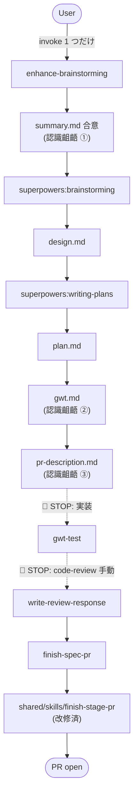

# enhance-superpowers コレクション新設 — サマリー

> 本書は TL;DR。詳細は design、実装手順は plan を参照（plan は `writing-plans` skill で後続作成）。

## 一言で

superpowers (公式) を base に、`~/.claude/CLAUDE.local.md` で運用してきた「コミット前提に直したローカル開発フローカスタマイズ」(5 成果物 / Spec 先行 / GWT テスト運用 / code-review 採用Skip / 設計思想 / コメント方針) を **skill+agent コレクション化**して、他環境 (他 PC / 業務 repo) にも持ち出せるようにする。`claude-collections` repo に indie-studio と並列で配置し、marketplace.json 登録で再利用可能にする。

## 方式の要点

- **brainstorming 拡張パターン**: `enhance-brainstorming` が起点、内部で `superpowers:brainstorming` → `writing-plans` を invoke して連鎖駆動。後工程 (`gwt-test` / `write-review-response` / `finish-spec-pr`) も連鎖で進む
- **summary-first 順序**: 5 成果物のうち summary を design より先に作り、Phase 2 で大枠合意を取って design 修正コストを下げる (認識齟齬検出を Spec フェーズに 3 重に分散)
- **shared/skills/finish-stage-pr 共有 helper の後方互換改修**: body-source-path 引数を追加して enhance-superpowers と indie-studio で両用化、コード重複を作らない
- **agent vendoring 最小**: `shared/agents/` から 4 体 (`code-reviewer` / `qa-engineer` / `software-architect` / `security-engineer`) のみ取り込み、新規 agent は initial 0 (YAGNI)
- **agent を skill ステップに織り込み (能動 dispatch)**: import だけで終わらせず、各 Phase で specialist agent を能動 dispatch — ドキュメントレビュー (Phase 1-5 で `software-architect` / `qa-engineer`)、AC 未達差し戻し (gwt-test で `qa-engineer`)、CodeRabbit 指摘判定 + 修正レビュー (write-review-response で `code-reviewer` / `security-engineer`)、実装フェーズの推奨パターン案内 (STOP POINT 1)
- **セキュリティレビューを 2 層 (設計レベル + コードレベル) でスコープ内に取り込み**: 設計レベルは enhance-brainstorming Phase 3 (design 生成後) と Phase 4 (plan 生成後) で `security-engineer` を **常時能動 dispatch** (検出条件付きを外す)。コードレベルは gwt-test 完了後の STOP POINT 2 案内に「code-review (CodeRabbit) 実行に加えて `security-engineer` で security-focused なコードレビューを 1 回実施」を必ず含める
- **監査ログ (agent dispatch log) を 5 成果物のレビュー履歴セクションに集約**: 各 skill で agent dispatch した際、`いつ / 誰を / 何のために dispatch したか + 回答要約` を該当成果物 (summary / design / plan / gwt / review-response) の末尾「## レビュー履歴」セクションに追記。「なぜこの設計を採ったか」のトレースに agent の助言も含めて説明可能にする。形式は ADR-0007 で定める
- **コンプライアンス 3 項目を薄く取り込み** (機微情報チェック / ライセンスチェック / AI 利用ポリシー案内): いずれも trigger / 案内のみで強制はしない (本コレクションは汎用 spec フローのため、規制 / ライセンス方針 / AI 利用方針はプロジェクトごとに異なる前提)。Phase 3 で機微情報チェックリスト + 適用規制 trigger を提示、Phase 4 で依存ライブラリのライセンスチェックを実施、各 skill Step 1 で `.ai-restrictions.md` を Read して案内

## フロー図

## 効いている設計判断

- **brainstorming 拡張パターン (案 B/C を退けて A 採用)**: superpowers の brainstorming hard-gate (user approval gate) と衝突しない、各 skill の責任境界が明確、保守コスト低。案 B (単一 flow skill が superpowers を内部連鎖) は hard-gate と衝突。案 C (規律 + テンプレートのみ) は規律強制が弱く「skill にする意味」が薄い
- **summary-first 順序**: 大枠ズレ (summary) → AC ズレ (gwt) → 動作確認方法ズレ (pr-description) を順次潰す。最大コストの齟齬を最も早く検出する「コスト × 検出時期」の最適化
- **finish-stage-pr 取り込み + body-source-path 拡張**: 既存共有 helper の push/draft 判定/label 自動付与を再利用、indie-studio 専用色テンプレも default 分岐として残して後方互換
- **新規 agent 初期 0 (YAGNI)**: shared/ の既存 4 体で initial は十分、足りなければ後で `dependencies.json` 編集 + 再 sync
- **CodeRabbit 必須前提を固定 (汎用化しない)**: 運用上 CodeRabbit を中核に据えているため、`write-review-response` の「採用/Skip 2 値判定」「自動 resolve 前提」を残す
- **Y 方式 (summary context を superpowers:brainstorming に委譲) を採用**: superpowers の design 生成ロジックを再利用、superpowers 更新の恩恵を受け続ける。Z 方式 (自前実装) は fallback として ADR-0006 に明記
- **agent 能動 dispatch の skill 内明示** (silent failure 回避): agent dispatch matrix を design に明記、「いつ・どの skill が・どの agent を・何のために dispatch するか」を一望可能にし、「import するだけで使わない」pattern を構造的に防ぐ。任意 dispatch 表現は skill 制御外 (STOP POINT 等) または検出条件付きの追加 dispatch でのみ許容
- **セキュリティレビューの 2 層化** (設計 + コード): エンプラ特有要素から除外せず、本コレクションのスコープ内に取り込んだ。設計レベルは Spec フェーズの Phase 3/4 で常時 dispatch、コードレベルは STOP POINT 2 で機械的レビュー (CodeRabbit) と専門家レビュー (security-engineer) の両輪で担保
- **監査ログとコンプライアンスを「薄く取り込み」原則で整理**: 監査ログは 5 成果物のレビュー履歴セクションに集約 (新規ファイル / 別 store を作らない)、コンプライアンスは trigger / 案内のみで強制せず (規制チェックは外部ツール、ライセンスチェックは license-checker 等の推奨案内、AI 利用ポリシーは .ai-restrictions.md があれば Read する程度)。エンプラ要素を全部入りで取り込むと環境ごとの上書きコストが膨らむため、「**本コレクションは trigger / 案内 / レビュー履歴の追記のみ、具体的チェックは環境側に委ねる**」という線を引いた
- **エンプラ特有要素のうちスコープ外は「変更管理 / 承認フロー」のみ**: 監査ログ / コンプライアンス / セキュリティレビューは全てスコープ内に取り込んだ。残る変更管理 / 承認フローは別コレクション / 別 ADR で後続検討。コード変更ログ (git log) / 本番デプロイ履歴 (CI/CD) は既存ツールで十分なため本コレクションのスコープ外

## スコープ外

- エンプラ特有要素のうち **変更管理 / 承認フロー** — 別コレクション / 別 ADR で後続検討 (※ セキュリティレビュー / 監査ログ / コンプライアンスはスコープ内に取り込み済み、後述「方式の要点」「効いている設計判断」参照)
- コード変更ログ (git log でカバー) / 本番デプロイ履歴 (CI/CD 領域) — 既存ツール責務
- 既存 indie-studio コレクションへの挙動変更 — finish-stage-pr 改修は後方互換、indie-studio 挙動は据え置き
- PR 作成の流れ (gh pr create --web ブラウザ目視 / Conventional Commits 厳守) — finish-stage-pr 共有 helper に委譲
- superpowers ドキュメント ID コメント禁止ルール — 個別判断 (CLAUDE.local.md から除外)

## 確認事項（実装フェーズ）

- **Y 方式 (superpowers:brainstorming への summary context 委譲) が成立するか** — enhance-brainstorming 初回実装時に dogfood。context を無視して会話を再開する場合は Z 方式 (自前実装) に移行 (ADR-0006 を trial 結果で update)
- **shared/skills/finish-stage-pr 改修の後方互換** — indie-studio で 1 回 PR 作成して挙動互換確認
- **agent 取り込み 4 体で実装フェーズが回るか** — initial 後の dogfood で過不足判定、足りなければ dependencies.json に追加
- **CodeRabbit が無い環境での write-review-response 挙動** — PC 以外の業務 repo で CodeRabbit を使わない場合に skill が宙に浮かないか確認
- **make sync で agents/ + skills/finish-stage-pr が両方展開されるか** — sync スクリプトが skills の取り込みも正しく扱うか確認 (shared/skills/ は ADR-0005 で対応済み、再確認)
- **5 成果物の frontmatter リンク先行記載が機能するか** — summary 生成時点 (Phase 2) で `design: ./{date}-{slug}-design.md` を先行記載、design.md は Phase 3 で同じ slug で生成される運用が壊れないか
- **agent dispatch matrix の dogfood 検証** — Phase 1-5 / gwt-test / write-review-response の各タイミングで指定の agent が能動 dispatch され、ドキュメント・コードレビューが silent failure せず差し戻しに繋がるか確認
- **セキュリティレビュー 2 層の dogfood 検証** — Phase 3/4 の security-engineer 常時 dispatch が「セキュリティ箇所が乏しいケース」でも空回りせず意味のあるレビューになるか、STOP POINT 2 の security-engineer 案内が user / 実装 AI に確実に届いて実行されるかを確認
- **dispatch log (監査ログ) の dogfood 検証** — 各 skill で agent dispatch した際、5 成果物の「レビュー履歴」セクションに `時刻 / agent / 目的 / 回答要約` が漏れなく追記されるか、log が散逸せず追跡可能か確認
- **コンプライアンス 3 項目 (機微情報チェック / ライセンスチェック / AI 利用ポリシー) の dogfood 検証** — Phase 3 の機微情報チェックリストが規制 trigger を漏れなく提示するか、Phase 4 のライセンスチェックが制限ライセンスを正しく warning するか、各 skill Step 1 の AI 利用ポリシー Read が `.ai-restrictions.md` 無し環境でも壊れずスキップされるか確認
