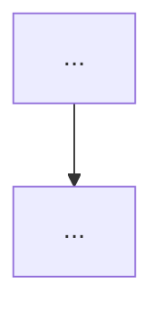

# spec-first-superpowers コレクション新設 Implementation Plan

> **For agentic workers:** REQUIRED SUB-SKILL: Use `superpowers:subagent-driven-development` (recommended) or `superpowers:executing-plans` to implement this plan task-by-task. Steps use checkbox (`- [ ]`) syntax for tracking.

**Goal:** `~/.claude/CLAUDE.local.md` で運用してきたローカル開発フローカスタマイズを `spec-first-superpowers` コレクションとして `claude-collections` repo に新設し、他環境にも持ち出せる skill+agent パッケージにする。

**Architecture:** indie-studio と並列の plugin collection を新設。`enhance-brainstorming` 起点で `superpowers:brainstorming` / `writing-plans` を内部 invoke、5 成果物 (summary / design / plan / gwt / pr-description) を Spec フェーズで確定、後工程 sub-skill (gwt-test / write-review-response / finish-spec-pr) を連鎖駆動。agent vendoring は `shared/` から 4 体 (`code-reviewer` / `qa-engineer` / `software-architect` / `security-engineer`)、`shared/skills/finish-stage-pr` は body-source-path 引数追加で後方互換改修。

**Tech Stack:**
- Markdown (skill / ADR / CONTEXT.md / template)
- JSON (.claude-plugin/plugin.json / dependencies.json / root marketplace.json)
- Bash (`make sync` / `make verify` / `make status` 経由で `scripts/sync-shared.sh`)
- 外部依存: 上位の superpowers plugin (公式 `mattpocock/skills`) が install 済み前提

## Global Constraints

- **コミット規律**: Conventional Commits 形式 (`docs:` / `feat:` / `fix:` / `refactor:` 等)、specific file 指定で `git add`、`amend` 禁止 (新 commit を作る)、`Co-Authored-By: Claude Opus 4.7 (1M context) <noreply@anthropic.com>` を末尾に付ける、HEREDOC でメッセージ渡す
- **ファイル配置**: spec / plan / summary / gwt / pr-description / ADR は `docs/superpowers/{branch}/` (worktree 同居、commit 前提)、コレクション本体は `spec-first-superpowers/` 配下
- **shared/ の取扱**: `shared/agents/` `shared/skills/` の真実源は touch せず、`make sync COLLECTION=spec-first-superpowers` で `spec-first-superpowers/agents/` `spec-first-superpowers/skills/finish-stage-pr/` に generated file として展開、generated file は手編集禁止
- **shared/skills/finish-stage-pr 改修**: 後方互換維持 (body-source-path 未指定で既存挙動)、indie-studio で dogfood 検証必須
- **agent dispatch 規律**: 各 skill ステップで agent を能動 dispatch、dispatch log は該当 5 成果物のレビュー履歴セクションに追記 (B)
- **未 commit のまま次フェーズに進まない**: AGENTS.md (project) の規律
- **main 直作業禁止**: 全変更は feat ブランチで実施 (現 cwd の worktree)

---

## File Structure

新規作成:

```
spec-first-superpowers/
├── CONTEXT.md                                         # ユビキタス言語 + scope + 設計思想 + 禁止語彙
├── docs/
│   └── adr/                                           # コレクション固有 ADR 0001-0010
│       ├── 0001-collection-scope-and-naming.md
│       ├── 0002-five-deliverables-and-order.md
│       ├── 0003-skill-chain-and-stop-points.md
│       ├── 0004-shared-skills-finish-stage-pr-extension.md
│       ├── 0005-agent-vendoring.md
│       ├── 0006-superpowers-brainstorming-context-delegation.md
│       ├── 0007-audit-trail-dispatch-log.md
│       ├── 0008-sensitive-data-check-in-spec-phase.md
│       ├── 0009-license-check-in-plan-phase.md
│       └── 0010-ai-utilization-policy-loading.md
├── skills/                                            # 4 skill
│   ├── enhance-brainstorming/SKILL.md
│   ├── gwt-test/SKILL.md
│   ├── write-review-response/SKILL.md
│   ├── finish-spec-pr/SKILL.md
│   └── finish-stage-pr/SKILL.md                       # ← make sync で生成、手編集禁止
├── agents/                                            # ← make sync で生成、手編集禁止
│   ├── code-reviewer.md
│   ├── qa-engineer.md
│   ├── software-architect.md
│   └── security-engineer.md
├── templates/
│   ├── summary.md
│   ├── gwt.md
│   ├── pr-description.md
│   └── review-response.md
└── .claude-plugin/
    ├── plugin.json                                    # plugin manifest
    └── dependencies.json                              # shared/ pick 宣言
```

修正:

```
shared/skills/finish-stage-pr/SKILL.md                 # argument-hint + Step 7 分岐追加 (後方互換)
.claude-plugin/marketplace.json                        # spec-first-superpowers entry 追加
CONTEXT-MAP.md                                         # コレクション索引に行追加
```

各ファイルの責任:
- **CONTEXT.md**: コレクションのユビキタス言語、scope、設計思想、indie-studio 禁止語彙、5 成果物の運用ルール
- **plugin.json**: plugin manifest (name, description, author, repository, keywords)
- **dependencies.json**: shared/agents/skills の pick 宣言
- **各 SKILL.md**: skill の動作・規律・dispatch matrix の skill ローカル抜粋
- **各 ADR**: 1 つの設計判断につき 1 ファイル (context / decision / consequences の 3 セクション)
- **各 template**: skill が読み込んで成果物の雛形にする markdown (frontmatter + プレースホルダー)

---

## Task 1: `shared/skills/finish-stage-pr` の body-source-path 引数追加 (後方互換改修)

**Files:**
- Modify: `shared/skills/finish-stage-pr/SKILL.md` (argument-hint 拡張 + Step 7 分岐追加)

**Interfaces:**
- Consumes: なし (本タスクは外部依存なし)
- Produces: 改修後の `finish-stage-pr` skill (`body-source-path` 任意引数を受け取れる)。indie-studio は引数なしで既存挙動、spec-first-superpowers の `finish-spec-pr` は `body-source-path={pr-description.md path}` を指定して呼ぶ

- [ ] **Step 1: 現状の SKILL.md を Read で確認**

Run: `Read shared/skills/finish-stage-pr/SKILL.md`
Expected: argument-hint が `<title-suggestion>  # body 用情報は呼び出し側 SKILL.md の prose で渡す`、Step 7 が「PR body を組み立て」で内蔵テンプレ (## 概要 / ## ゲートレポート / 繰り越し論点 / ## 関連) を持つ。

- [ ] **Step 2: argument-hint を拡張する Edit**

Edit `shared/skills/finish-stage-pr/SKILL.md`:
```
old_string:
argument-hint: "<title-suggestion>  # body 用情報は呼び出し側 SKILL.md の prose で渡す"

new_string:
argument-hint: "<title-suggestion> [body-source-path]  # body-source-path 未指定なら内蔵テンプレ、指定ならそのファイル内容を body にする"
```

- [ ] **Step 3: Step 7 に分岐ロジックを追加する Edit**

Edit `shared/skills/finish-stage-pr/SKILL.md`:
```
old_string:
### Step 7: PR body を組み立て

テンプレ：

```markdown
## 概要
<呼び出し側からの 1 行説明>

new_string:
### Step 7: PR body を組み立て

呼び出し側から `body-source-path` (任意引数) が渡された場合:
- そのファイルを Read で読み込み、内容を body として使う (改行・セクション構造をそのまま渡す)
- ファイルが存在しなければ error 報告 + 中断 ("body-source-path で指定されたファイルが見つかりません: <path>")

渡されていない場合 (default、indie-studio 経由など):
- 以下の内蔵テンプレで body を構築 (既存挙動と完全互換)

テンプレ：

```markdown
## 概要
<呼び出し側からの 1 行説明>
```

- [ ] **Step 4: 改修内容を確認 (Read で再読)**

Run: `Read shared/skills/finish-stage-pr/SKILL.md`
Expected: argument-hint が `<title-suggestion> [body-source-path]` 形式、Step 7 冒頭で「body-source-path 指定時はファイル内容を body にする / 未指定時は内蔵テンプレ」の分岐が明示されている。

- [ ] **Step 5: Commit**

```bash
git add shared/skills/finish-stage-pr/SKILL.md
git commit -m "$(cat <<'EOF'
feat(shared/skills): finish-stage-pr に body-source-path 引数を追加 (後方互換)

body-source-path 任意引数で外部ファイルから body を読み込めるように拡張。
未指定なら既存の内蔵テンプレ動作を維持 (indie-studio 等の既存呼び出しは無変更)。
spec-first-superpowers の finish-spec-pr が pr-description.md を body として渡す
用途で利用予定 (ADR-0004)。

Co-Authored-By: Claude Opus 4.7 (1M context) <noreply@anthropic.com>
EOF
)"
```

---

## Task 2: `spec-first-superpowers/` 骨格作成 (CONTEXT.md + plugin.json + ディレクトリ)

**Files:**
- Create: `spec-first-superpowers/CONTEXT.md`
- Create: `spec-first-superpowers/.claude-plugin/plugin.json`
- Create: `spec-first-superpowers/docs/adr/.gitkeep` (ADR 0001-0010 は Task 5/6 で配置)
- Create: `spec-first-superpowers/skills/.gitkeep` (実体は Task 7-10 で配置)
- Create: `spec-first-superpowers/agents/.gitkeep` (実体は Task 4 で make sync 生成)
- Create: `spec-first-superpowers/templates/.gitkeep` (実体は Task 3 で配置)

**Interfaces:**
- Consumes: なし (新規作成)
- Produces: コレクションの骨格。後続タスク (templates / skills / ADR / make sync) はこの骨格を前提とする

- [ ] **Step 1: ディレクトリ構造作成**

Run:
```bash
mkdir -p spec-first-superpowers/{docs/adr,skills,agents,templates,.claude-plugin}
touch spec-first-superpowers/docs/adr/.gitkeep
touch spec-first-superpowers/skills/.gitkeep
touch spec-first-superpowers/agents/.gitkeep
touch spec-first-superpowers/templates/.gitkeep
ls -la spec-first-superpowers/
```
Expected: 5 ディレクトリ (docs/adr, skills, agents, templates, .claude-plugin) と .gitkeep 4 個が見える。

- [ ] **Step 2: CONTEXT.md を作成**

Write `spec-first-superpowers/CONTEXT.md`:
```markdown
# spec-first-superpowers コレクション

superpowers (公式) を base に、ローカル開発フローの規律 (5 成果物 / Spec 先行 / GWT テスト運用 / code-review 採用Skip / 設計思想 / コメント方針) を skill+agent コレクション化したもの。中規模開発で Spec フェーズに認識齟齬検出を 3 重に分散する思想。

## Language

**5 成果物 (Five deliverables)**:
Spec フェーズで生成される 5 つの markdown ファイル — summary / design / plan / gwt / pr-description。生成順は summary-first (summary → design → plan → gwt → pr-description)。命名は `{YYYY-MM-DD}-{slug}-{suffix}.md`。配置は `docs/superpowers/{branch}/`。

**enhance-brainstorming**:
spec-first-superpowers の起点 skill。`superpowers:brainstorming` の責任を拡張し、5 成果物の Spec フェーズ確定 + 後工程 sub-skill の連鎖駆動を担う。ユーザーが意識的に呼ぶ唯一の skill。

**STOP POINT**:
skill 連鎖の途中で人間 (or 実装 AI) の介入が必要な箇所。本コレクションは 2 つ持つ — STOP POINT 1 (実装フェーズ) と STOP POINT 2 (セルフレビュー = `code-review` skill 手動実行)。

**認識齟齬検出ポイント**:
Spec フェーズで設計の認識ズレを早期検出する 3 重の関所 — ① summary 合意 (大枠ズレ) / ② gwt 合意 (AC ズレ) / ③ pr-description 合意 (動作確認方法ズレ)。

**agent dispatch matrix**:
各 skill ステップで能動 dispatch する agent と目的の一覧 (本リポジトリの設計 doc / ADR-0007 参照)。`import するだけで使わない` silent failure pattern を回避するための明示的な対応表。

**レビュー履歴セクション**:
5 成果物の末尾に追加される `## レビュー履歴` セクション。agent dispatch log (時刻 / agent / 目的 / 回答要約) をここに集約 (B = 監査ログ)。形式は ADR-0007 で定める。

**Y 方式**:
enhance-brainstorming Phase 3 で合意済み summary を context として `superpowers:brainstorming` に委譲し design.md を生成させる実装方式。fallback (Z 方式 = 自前実装) は ADR-0006 に明記。

## indie-studio との禁止語彙

indie-studio コレクションが使う以下の語彙は、spec-first-superpowers では **使わない** (思想が異なるため、同じ語彙で混乱を生まない):

- `S1〜S5` (ステージ番号)
- ゲート / 大枠ゲート (G1〜G5)
- 繰り越し決定 (Deferred decision)
- アンカー (Anchor)
- 自走設計 / 補助設計
- self-grill / 導出エージェント / 評価エージェント
- Claude Design / ハンドオフバンドル / プロトタイプブリーフ
- ハーネス / オーケストレーター / ディレクター

spec-first-superpowers は superpowers (公式) の直線フロー (brainstorming → writing-plans → executing-plans) を尊重しつつ、その上に「Spec フェーズの 5 成果物確定」「後工程連鎖」「agent 能動 dispatch」を被せる設計。

## 設計思想

- **Clean Architecture + Modular Monolith** を採用 (既存プロジェクトに別規約があればそちら優先)
- **YAGNI / DRY / KISS / SOLID** を遵守、衝突時は **SOLID 最優先**
- **DRY はテストコードで一部許容** (Given/When は重複可、assertion helper / factory / fixture builder は共通化可)
- **コードコメントは WHY のみ**、JSDoc 抑制
- **agent 能動 dispatch**: 各 skill ステップで agent を必ず使う場面を織り込む (silent failure 回避)
- **コミット前提**: 設計ドキュメントは worktree 同居・main 退避なし

## 配置

| ファイル | 配置先 |
|---|---|
| 5 成果物 (design / plan / summary / gwt / pr-description) | `docs/superpowers/{branch}/` |
| review-response.md | 同上 |
| コレクション固有 ADR | `spec-first-superpowers/docs/adr/` |
| skill / agent / template | `spec-first-superpowers/{skills,agents,templates}/` |

## 関連

- 設計 doc: `docs/superpowers/feat-enterprise-superpowers-customization/2026-06-25-spec-first-superpowers-collection-design.md`
- summary: 同 dir の `-summary.md`
- plan: 同 dir の `-plan.md`
- ADR 0001-0010 (コレクション固有): `spec-first-superpowers/docs/adr/`
- root ADR: `docs/adr/` (リポジトリ全体の決定)
```

- [ ] **Step 3: plugin.json を作成**

Write `spec-first-superpowers/.claude-plugin/plugin.json`:
```json
{
  "$schema": "https://json.schemastore.org/claude-code-plugin-manifest.json",
  "name": "spec-first-superpowers",
  "description": "superpowers 拡張: Spec フェーズで 5 成果物 (summary/design/plan/gwt/pr-description) を確定、後工程 (gwt-test/write-review-response/finish-spec-pr) を連鎖駆動。agent 能動 dispatch + 監査ログ + セキュリティレビュー + コンプライアンス trigger を内包。",
  "author": {
    "name": "gotomts",
    "email": "mh.goto.web@gmail.com"
  },
  "repository": "https://github.com/gotomts/claude-collections",
  "keywords": ["superpowers-extension", "spec-first", "5-deliverables", "agent-dispatch", "audit-trail", "development-workflow"]
}
```

- [ ] **Step 4: 骨格の存在を確認**

Run:
```bash
ls -la spec-first-superpowers/
cat spec-first-superpowers/CONTEXT.md | head -20
cat spec-first-superpowers/.claude-plugin/plugin.json
```
Expected: ディレクトリ 5 個 + CONTEXT.md + .claude-plugin/plugin.json が存在、CONTEXT.md 冒頭は「spec-first-superpowers コレクション」、plugin.json は spec-first-superpowers として valid JSON。

- [ ] **Step 5: Commit**

```bash
git add spec-first-superpowers/CONTEXT.md \
        spec-first-superpowers/.claude-plugin/plugin.json \
        spec-first-superpowers/docs/adr/.gitkeep \
        spec-first-superpowers/skills/.gitkeep \
        spec-first-superpowers/agents/.gitkeep \
        spec-first-superpowers/templates/.gitkeep
git commit -m "$(cat <<'EOF'
feat(spec-first-superpowers): コレクション骨格 (CONTEXT.md + plugin.json + ディレクトリ構造)

claude-collections repo に spec-first-superpowers コレクションを新設する第一歩。
indie-studio と並列の plugin collection として、CONTEXT.md (ユビキタス言語 +
indie-studio 禁止語彙 + 設計思想) と plugin manifest を配置。skills / agents /
templates / docs/adr ディレクトリは .gitkeep で確保 (実体は後続タスクで配置)。

Co-Authored-By: Claude Opus 4.7 (1M context) <noreply@anthropic.com>
EOF
)"
```

---

## Task 3: templates 4 種を `spec-first-superpowers/templates/` に配置

**Files:**
- Create: `spec-first-superpowers/templates/summary.md`
- Create: `spec-first-superpowers/templates/gwt.md`
- Create: `spec-first-superpowers/templates/pr-description.md`
- Create: `spec-first-superpowers/templates/review-response.md`
- Delete: `spec-first-superpowers/templates/.gitkeep`

**Interfaces:**
- Consumes: なし
- Produces: 4 種 template (各 skill が Read で読み込んで成果物生成の雛形にする)。レビュー履歴セクション (B) は summary / gwt / review-response に組み込み、pr-description のみ例外 (最小構造維持)

- [ ] **Step 1: summary.md を作成 (~/.claude/local-templates/superpowers-summary.md を base、レビュー履歴セクション追加)**

Write `spec-first-superpowers/templates/summary.md`:
```markdown
---
title: {機能名} — サマリー（TL;DR）
issue: {issue-url}
design: ./{YYYY-MM-DD}-{slug}-design.md
related:
  - {関連 PR/issue URL}  # 何を取り込む / 依存するかを 1 行で補足
---

# {機能名} — サマリー

> 本書は TL;DR。詳細は design、実装手順は plan を参照（plan は `writing-plans` skill で後続作成）。

## 一言で

{この機能が何を実現するか、採用する主方式・既存パターンとの関係を 2〜3 文で}

## 方式の要点

- **{方式 1}**: {要点・採否理由}
- **{方式 2}**: {要点・採否理由}

## フロー図



## 効いている設計判断

- **{判断 1}**: {理由・トレードオフ・他案を採らない根拠}
- **{判断 2}**: {理由・トレードオフ}

## スコープ外

- {今回含めない項目とその理由}

## 確認事項（実装フェーズ）

- {実装時に実物で動作確認すべき点 / 回帰確認すべき点}

## レビュー履歴

> 各 Phase で agent を dispatch した記録 (時刻 / agent / 目的 / 回答要約)。enhance-brainstorming Phase 2 で初期化、後続 Phase の dispatch log も追記される。形式は ADR-0007 参照。

- {YYYY-MM-DD HH:MM} - `{agent-name}` を Phase {N} で dispatch (目的: {目的}) → 「{回答要約}」
```

- [ ] **Step 2: gwt.md を作成 (レビュー履歴セクション追加)**

Write `spec-first-superpowers/templates/gwt.md`:
```markdown
---
title: {機能名} — 受け入れ条件（GWT）
issue: {issue-url}
design: ./{YYYY-MM-DD}-{slug}-design.md
summary: ./{YYYY-MM-DD}-{slug}-summary.md
---

# {機能名} — 受け入れ条件

> Given-When-Then 形式。各 AC は独立した検証単位。design の方式・summary の TL;DR を満たすことを確認する受け入れ基準とする。

## AC-1: {シナリオ名}

- **Given**: {前提条件・初期状態}
- **When**: {ユーザー操作・イベント}
- **Then**: {期待される観測可能な結果}

## AC-2: {シナリオ名}

- **Given**: {前提条件}
- **When**: {操作}
- **Then**: {期待結果}

## 異常系 / エッジケース

### AC-E1: {異常シナリオ名}

- **Given**: {異常を誘発する前提}
- **When**: {操作}
- **Then**: {エラーハンドリング・フォールバックの期待挙動}

## スコープ外（受け入れ対象としない）

- {検証しない項目とその理由}

## 検証チェックリスト

> 各 AC の検証状況を一覧で管理する。テストして AC を満たしたら `- [ ]` を `- [x]` に書き換える。

- [ ] AC-1: {シナリオ名}
- [ ] AC-2: {シナリオ名}
- [ ] AC-E1: {異常シナリオ名}

## 変更履歴

> テスト実施でバグが発覚し AC を修正した場合や、仕様変更で受け入れ条件が更新された場合に追記する。新しいエントリを上に積む（逆時系列）。

- {YYYY-MM-DD}: {対象AC} — {変更内容}（{変更理由・関連 issue / PR}）

## レビュー履歴

> enhance-brainstorming Phase 5 + gwt-test の AC 未達発覚時に dispatch した agent の log を追記。形式は ADR-0007 参照。

- {YYYY-MM-DD HH:MM} - `{agent-name}` を {Phase 5 / gwt-test} で dispatch (目的: {目的}) → 「{回答要約}」
```

- [ ] **Step 3: pr-description.md を作成 (frontmatter なし、レビュー履歴セクションなし = B 例外)**

Write `spec-first-superpowers/templates/pr-description.md`:
```markdown
## やったこと

- {変更点 1}
- {変更点 2}

## 補足

> ※ あれば

<実装方針の判断理由、技術的トレードオフ、レビュアーへの注意点等。内容がない場合は本セクションごと削除する。>

## 動作確認方法

> ※ ダッシュボードからの手順を記載。システム外（管理画面外）からのアクセスが必要な場合は対象 URL も提供する。

1. {手順 1}
2. {手順 2}
3. {期待される結果}
```

- [ ] **Step 4: review-response.md を作成 (レビュー履歴セクション追加)**

Write `spec-first-superpowers/templates/review-response.md`:
```markdown
---
title: {機能名} — code-review 指摘への対応方針
issue: {issue-url}
spec: ./{YYYY-MM-DD}-{slug}-design.md
summary: ./{YYYY-MM-DD}-{slug}-summary.md
gwt: ./{YYYY-MM-DD}-{slug}-gwt.md
---

# {機能名} — code-review 指摘への対応方針

> {YYYY-MM-DD} に {source: `code-review` skill (CodeRabbit) / GitHub PR の CodeRabbit インラインコメント (unresolved 分のみ)} で {対象 commit range or PR URL} を review した結果を整理する。
> 採用 {N} 件は本 PR で fix、Skip {M} 件は理由付きで本 PR スコープ外と判定。
> PR コメントが source の場合: CodeRabbit へのリプライは送らない。修正済みのコメントは CodeRabbit が自動 resolve しているため、本 md には残った unresolved コメントへの判定のみ記録する。

## 指摘サマリー ({N} 件)

| 重要度 | 件数 | 内訳 |
| --- | --- | --- |
| Major | {n} | {ID 一覧: 例 M1 (xxx) / M2 (yyy)} |
| Minor | {n} | {ID 一覧: 例 Mi1 (xxx)} |
| Trivial | {n} | {ID 一覧: 例 T1 (xxx) / T2 (yyy)} |

判定結果: **採用 {N} 件** / **Skip {M} 件**。

## 採用 ({N} 件) — 本 PR で fix

### {ID}. {タイトル} ({対象ファイル})

**指摘**: {CodeRabbit の指摘要約}

**判定**: 採用。{採用理由}

**修正案**:

```{lang}
// 修正前
{修正前のコード}

// 修正後
{修正後のコード}
```

**効果**: {挙動・副作用・他指摘への影響。任意セクション}

## Skip ({M} 件) — 本 PR スコープ外

### {ID}. {タイトル} ({対象ファイル})

**指摘**: {CodeRabbit の指摘要約}

**Skip 理由**: {下記いずれかに該当することを明記}

- 別 PR で対応する技術的な理由（既存パターンとの同型維持 / 全 caller 評価が必要 等）
- プロジェクト規約で enforce されていない style 系の不採用
- 他の採用済み指摘で自動消化されるため不要

## 連動関係と効果

- {指摘間の依存・自動消化関係。例: M4 採用により T7 が自動消化}
- {commit 構成計画。例: 採用 {N} 件はまとめて 1 commit として積む}
- {その他の所感・PR description への引用ポイント}

## レビュー履歴

> code-reviewer / security-engineer の dispatch log を集約。STOP POINT 2 で実施した security-engineer のコードセキュリティレビュー結果もここに記録。形式は ADR-0007 参照。

- {YYYY-MM-DD HH:MM} - `{agent-name}` を write-review-response で dispatch (目的: {目的}) → 「{回答要約}」
- {YYYY-MM-DD HH:MM} - `security-engineer` を STOP POINT 2 で dispatch (目的: security-focused コードレビュー) → 「{回答要約}」
```

- [ ] **Step 5: .gitkeep を削除して templates 配置を確認**

Run:
```bash
rm spec-first-superpowers/templates/.gitkeep
ls -la spec-first-superpowers/templates/
```
Expected: summary.md / gwt.md / pr-description.md / review-response.md の 4 ファイルのみ。

- [ ] **Step 6: Commit**

```bash
git add spec-first-superpowers/templates/
git commit -m "$(cat <<'EOF'
feat(spec-first-superpowers): templates 4 種を配置 (summary / gwt / pr-description / review-response)

5 成果物のうち summary / gwt / pr-description と、レビュー対応の review-response の
4 種 template を spec-first-superpowers/templates/ に同梱。~/.claude/local-templates/
の現テンプレを base に、summary / gwt / review-response に「## レビュー履歴」
セクションを追加 (B = 監査ログ集約先、形式は ADR-0007 で定める)。pr-description は
最小構造維持のため例外。

Co-Authored-By: Claude Opus 4.7 (1M context) <noreply@anthropic.com>
EOF
)"
```

---

## Task 4: dependencies.json 作成 + `make sync` で agents/skills を取り込み

**Files:**
- Create: `spec-first-superpowers/.claude-plugin/dependencies.json`
- Auto-generated: `spec-first-superpowers/agents/{code-reviewer,qa-engineer,software-architect,security-engineer}.md` (make sync 生成、手編集禁止)
- Auto-generated: `spec-first-superpowers/skills/finish-stage-pr/SKILL.md` (make sync 生成、手編集禁止)
- Delete: `spec-first-superpowers/agents/.gitkeep` (sync で実体ができたら不要)

**Interfaces:**
- Consumes: Task 1 で改修した `shared/skills/finish-stage-pr/SKILL.md` (body-source-path 引数対応版)
- Produces: コレクションに取り込まれた agent 4 体 + finish-stage-pr skill 1 件。後続タスクの skill 実装 (Task 7-10) はこの取り込み済み skill を呼ぶ前提

- [ ] **Step 1: dependencies.json を作成**

Write `spec-first-superpowers/.claude-plugin/dependencies.json`:
```json
{
  "shared": {
    "agents": [
      "code-reviewer",
      "qa-engineer",
      "software-architect",
      "security-engineer"
    ],
    "skills": [
      "finish-stage-pr"
    ]
  }
}
```

- [ ] **Step 2: make sync で実体化**

Run: `make sync COLLECTION=spec-first-superpowers`
Expected: `Synced: spec-first-superpowers/agents/{code-reviewer,qa-engineer,software-architect,security-engineer}.md` および `Synced: spec-first-superpowers/skills/finish-stage-pr/SKILL.md` の log。エラーなく完了。

- [ ] **Step 3: 取り込み結果を確認**

Run:
```bash
ls -la spec-first-superpowers/agents/
ls -la spec-first-superpowers/skills/finish-stage-pr/
head -10 spec-first-superpowers/agents/code-reviewer.md
```
Expected: agents/ に 4 ファイル (.gitkeep は残ったままなら次 step で削除)、skills/finish-stage-pr/SKILL.md が存在、generated file の frontmatter に `x-source` / `x-source-hash` / `x-body-hash` / `x-synced-at` が含まれる。

- [ ] **Step 4: .gitkeep 削除**

Run: `rm spec-first-superpowers/agents/.gitkeep`

- [ ] **Step 5: make verify で drift なし確認**

Run: `make verify`
Expected: 全コレクションで drift なし (`OK: no drift detected` 等の log)、exit code 0。

- [ ] **Step 6: Commit (dependencies.json + generated files)**

```bash
git add spec-first-superpowers/.claude-plugin/dependencies.json \
        spec-first-superpowers/agents/ \
        spec-first-superpowers/skills/finish-stage-pr/
git commit -m "$(cat <<'EOF'
feat(spec-first-superpowers): dependencies.json + make sync で agents 4 + finish-stage-pr 取り込み

shared/ から code-reviewer / qa-engineer / software-architect / security-engineer の
4 agent と、Task 1 で改修済みの finish-stage-pr skill 1 件を vendoring。

generated file は手編集禁止 (frontmatter に x-source / x-source-hash /
x-body-hash / x-synced-at を持ち、shared/ 更新時は make sync で再生成、
手編集は make verify が body-hash mismatch で検知)。

ADR-0005 (agent vendoring 選定理由) はこの dependencies.json と整合。

Co-Authored-By: Claude Opus 4.7 (1M context) <noreply@anthropic.com>
EOF
)"
```

---

## Task 5: ADR 0001-0006 を起草 (設計判断系)

**Files:**
- Create: `spec-first-superpowers/docs/adr/0001-collection-scope-and-naming.md`
- Create: `spec-first-superpowers/docs/adr/0002-five-deliverables-and-order.md`
- Create: `spec-first-superpowers/docs/adr/0003-skill-chain-and-stop-points.md`
- Create: `spec-first-superpowers/docs/adr/0004-shared-skills-finish-stage-pr-extension.md`
- Create: `spec-first-superpowers/docs/adr/0005-agent-vendoring.md`
- Create: `spec-first-superpowers/docs/adr/0006-superpowers-brainstorming-context-delegation.md`

**Interfaces:**
- Consumes: 設計 doc / summary.md (`docs/superpowers/feat-enterprise-superpowers-customization/2026-06-25-spec-first-superpowers-collection-{design,summary}.md`) の内容
- Produces: コレクション設計判断の永続化 ADR 6 件。後続タスク (skill 実装) はこれらの ADR を「~に従う」と参照する

ADR の共通フォーマット (Michael Nygard 形式):

```markdown
# {ADR ID}. {タイトル}

## Status

Accepted ({YYYY-MM-DD})

## Context

{なぜこの判断が必要か、何が問題で、どのような選択肢があるか}

## Decision

{採用する方式と理由}

## Consequences

{この判断による影響、トレードオフ、後続で生じる課題}

## Alternatives Considered

{却下した代替案とその理由 (任意セクション)}
```

- [ ] **Step 1: ADR 0001 collection-scope-and-naming を作成**

Write `spec-first-superpowers/docs/adr/0001-collection-scope-and-naming.md`:
```markdown
# 0001. コレクションのスコープと命名

## Status

Accepted (2026-06-25)

## Context

`~/.claude/CLAUDE.local.md` で運用してきた superpowers カスタマイズ (5 成果物 / Spec 先行 / GWT テスト運用 / code-review 採用Skip / 設計思想 / コメント方針) は PC ローカル設定に閉じており、他環境 (他 PC / 業務 repo) に持ち出せない。コミット前提の repo でも同じフローを使いたいが、ローカルファイル参照や PC 固有規約 (worktree → main 退避) が混ざっているため、そのまま持ち出すと壊れる。

## Decision

claude-collections repo に **`spec-first-superpowers`** という plugin collection を新設する。indie-studio と並列の自己完結コレクションとして配置。「コミット前提で他環境に持ち出せる部分」のみを抽出してパッケージ化する。

スコープ:
- **In**: コレクション新設、shared/skills/finish-stage-pr の後方互換改修、marketplace.json 登録、CONTEXT-MAP.md 索引追加、セキュリティレビュー (2 層)、監査ログ (dispatch log)、コンプライアンス 3 項目 (機微情報チェック / ライセンスチェック / AI 利用ポリシー案内)
- **Out**: 変更管理 / 承認フロー (別コレクション扱い)、コード変更ログ (git カバー)、本番デプロイ履歴 (CI/CD カバー)、indie-studio 挙動変更

命名は **`spec-first-superpowers`** — 「Spec フェーズで 5 成果物 (特に pr-description) を先行確定」がコレクションの最大の独自性を直撃。enterprise や production よりも特徴を捉える。

## Consequences

- claude-collections の plugin が 2 つ (indie-studio + spec-first-superpowers) になる、marketplace.json 登録で他人も install 可能
- CONTEXT.md に「indie-studio 禁止語彙 (S1〜S5 / ゲート / 繰り越し決定 / アンカー / Claude Design 等)」を明示して語彙の混在を防ぐ
- 後続で「監査ログ / コンプライアンス特化コレクション」を別途立てる場合、本コレクションは触らず別 dir で進める

## Alternatives Considered

- `enterprise-superpowers` — 命名上 enterprise を冠すると監査 / コンプラ / 承認フロー等の含意が出るが、本コレクションはローカルフロー流用が主旨で誤誘導。却下
- `disciplined-superpowers` — 規律強化のニュアンスは良いが superpowers 自体が既に規律 skill 集で差分が伝わらない。却下
- `personal-superpowers` — オーナー個人スタイルとして率直だが、他人にも使ってもらえる前提と矛盾。却下
```

- [ ] **Step 2: ADR 0002 five-deliverables-and-order を作成**

Write `spec-first-superpowers/docs/adr/0002-five-deliverables-and-order.md`:
```markdown
# 0002. 5 成果物の出所と summary-first 順序

## Status

Accepted (2026-06-25)

## Context

CLAUDE.local.md の運用では Spec フェーズで 5 つの成果物 (design / plan / summary / gwt / pr-description) を作る。元々の運用順は「design → plan → summary → gwt → pr-description」で、summary は design の TL;DR として後追いで作っていた。しかし、design.md が長文になるとレビューコストが高く、design 全体を見直す手戻りが大きい。

## Decision

5 成果物の生成順を **summary-first** に変更する: `summary → design → plan → gwt → pr-description`。

各成果物の出所:

| 順 | 成果物 | 出所 |
|---|---|---|
| 1 | summary.md | enhance-brainstorming (templates) — 合意メモ |
| 2 | design.md | superpowers:brainstorming (合意済み summary を context として渡す = Y 方式 / ADR-0006) |
| 3 | plan.md | superpowers:writing-plans |
| 4 | gwt.md | enhance-brainstorming (templates) |
| 5 | pr-description.md | enhance-brainstorming (templates) |

templates は `spec-first-superpowers/templates/` に同梱 (PC 以外でも使う前提)。CodeRabbit 前提文言は残す (汎用化しない、ADR-0001 のスコープ判断と整合)。

## Consequences

- Spec フェーズに認識齟齬検出ポイントが **3 重**になる: ① summary 合意 (大枠ズレ) → ② gwt 合意 (AC ズレ) → ③ pr-description 合意 (動作確認方法ズレ)。最大コストの齟齬 (大枠) を最も早く検出する「コスト × 検出時期」の最適化
- summary 生成時点 (Phase 2) で slug は確定済みなので、summary frontmatter に `design: ./{date}-{slug}-design.md` を **先行記載**できる (design.md は Phase 3 で同じ slug で生成される)
- pr-description の Spec フェーズ先行作成 (CLAUDE.local.md 由来) は維持。動作確認方法の言語化を Spec で潰すことで実装後の手戻りを防ぐ

## Alternatives Considered

- design → summary の従来順 — design の長文に対するレビューコストが高く、手戻りも大きい。却下
- summary を作らず design.md のみ — TL;DR がないと一望性が低く、PR レビュアーや他 collaborator が読む際の負担が大きい。却下
```

- [ ] **Step 3: ADR 0003 skill-chain-and-stop-points を作成**

Write `spec-first-superpowers/docs/adr/0003-skill-chain-and-stop-points.md`:
```markdown
# 0003. skill 連鎖と 2 stop point

## Status

Accepted (2026-06-25)

## Context

spec-first-superpowers は 4 skill (enhance-brainstorming / gwt-test / write-review-response / finish-spec-pr) で構成される。ユーザーが意識的に呼ぶ skill を最小化したい (理想は 1 skill のみ)、かつ各 skill の責任境界は明確にしたい。superpowers (公式) の brainstorming → writing-plans → executing-plans が「ユーザーは brainstorming 1 つだけ呼べば連鎖で進む」設計なので、これと同じ思想にしたい。

## Decision

`enhance-brainstorming` を **起点 skill** とし、内部で sub-skill (gwt-test / write-review-response / finish-spec-pr) を terminal state として連鎖 invoke する。フェーズ間で人間 (or 実装 AI) の介入が必要な箇所は **STOP POINT** として明示する。

- **STOP POINT 1**: 実装フェーズ — Spec フェーズ完了後、人間 or AI が実装する箇所
- **STOP POINT 2**: セルフレビュー — `code-review` skill (CodeRabbit) を user が手動 invoke する箇所。STOP POINT 2 案内には security-engineer によるコードレビューも含める (ADR-0008 関連)

stop 後の再開は (a) ユーザーが `enhance-brainstorming` を再 invoke (状態判定して続きから)、または (b) 個別 sub-skill (gwt-test / write-review-response / finish-spec-pr) を直接 invoke、のいずれでも可。

## Consequences

- ユーザーが意識的に呼ぶ skill は 1 つ (`enhance-brainstorming`)、superpowers と同じイメージ
- sub-skill を独立 skill にしているため、stop 後の再開や中断後の個別 invoke が柔軟
- 各 skill の責任境界が明確 (1 skill = 1 フェーズ)、保守コスト低
- superpowers の brainstorming hard-gate (user approval まで実装に進まない) と衝突しない (本コレクションは superpowers の skill を delegate で呼ぶだけ)

## Alternatives Considered

- 案 B: 単一 flow skill が end-to-end 進行 — brainstorming hard-gate と衝突、superpowers 更新で壊れやすい。却下
- 案 C: 規律 skill + テンプレートのみ (skill なし) — 規律強制が弱く skill 化の意味が薄い。却下
```

- [ ] **Step 4: ADR 0004 shared-skills-finish-stage-pr-extension を作成**

Write `spec-first-superpowers/docs/adr/0004-shared-skills-finish-stage-pr-extension.md`:
```markdown
# 0004. shared/skills/finish-stage-pr の body-source-path 拡張 (後方互換改修)

## Status

Accepted (2026-06-25)

## Context

`shared/skills/finish-stage-pr` は push + PR open を担う共有 helper で、Step 7 に body 構築の内蔵テンプレ (## 概要 / ## ゲートレポート / 繰り越し論点 / ## 関連) を持つ。このテンプレは indie-studio 専用色が強い (ゲート / 繰り越し論点 / stage は indie-studio の語彙)。

spec-first-superpowers の `finish-spec-pr` は、Spec フェーズで作成した `pr-description.md` (`## やったこと` / `## 補足` / `## 動作確認方法` の 3 セクション固定) を body として PR を作りたい。両者のテンプレ構造は互換性がない。

## Decision

`shared/skills/finish-stage-pr` の **Step 7 を分岐型にリファクタ**する (後方互換維持):

- 呼び出し側が `body-source-path` (任意引数) を渡した場合 → そのファイルを Read で読み込み、内容を body にする
- 渡さない場合 (default、indie-studio など既存呼び出し) → 既存の内蔵テンプレで body を構築

`argument-hint` も `<title-suggestion> [body-source-path]` 形式に拡張。

## Consequences

- indie-studio は引数なしで既存挙動 (内蔵テンプレ)、変更なし
- spec-first-superpowers の finish-spec-pr は `body-source-path={pr-description.md path}` を渡して呼ぶ
- 改修後 indie-studio で 1 回 PR 作成して dogfood 検証必須 (互換性確認)
- 将来、別コレクションが別のテンプレで body を渡したい場合も同じ仕組みで拡張可能 (Open/Closed Principle に準拠)

## Alternatives Considered

- 案 B: spec-first-superpowers のテンプレを finish-stage-pr 既存テンプレに揃える — pr-description の独自性 (3 セクション固定 + CodeRabbit 自動サマリー前提) を捨てることになり、CLAUDE.local.md の設計意図と衝突。却下
- 案 C: spec-first-superpowers が独自に push + gh pr create を実装 — コード重複、共有 helper の意義が薄れる。却下
```

- [ ] **Step 5: ADR 0005 agent-vendoring を作成**

Write `spec-first-superpowers/docs/adr/0005-agent-vendoring.md`:
```markdown
# 0005. agent vendoring の選定理由 (4 体取り込み)

## Status

Accepted (2026-06-25)

## Context

`shared/agents/` には 13 体の engineering 系 agent (backend / frontend / mobile / infrastructure / performance / security / qa / code-reviewer / reviewer / software-architect / tech-lead / engineering-manager / principal-engineer) がある。spec-first-superpowers でどれを取り込むかが論点。

## Decision

initial で取り込む agent は **4 体** に絞る:

- `software-architect` — enhance-brainstorming Phase 1-3 (アプローチ / summary / design レビュー)、実装フェーズの任意 dispatch 案内
- `qa-engineer` — enhance-brainstorming Phase 4 (plan のテスト戦略) + Phase 5 (gwt の AC 網羅性) + gwt-test の AC 未達発覚時
- `code-reviewer` — write-review-response の判定迷い時 / 採用後修正の再 push 前 + 実装フェーズの任意 dispatch 案内
- `security-engineer` — enhance-brainstorming Phase 3/4 で常時能動 dispatch (セキュリティレビュー + 機微情報チェック) + write-review-response のセキュリティ系指摘 + STOP POINT 2 (code-review に加えて security-focused コードレビュー)

`dependencies.json` の `shared.agents[]` で宣言、`make sync` で `spec-first-superpowers/agents/` に generated file として展開。

## Consequences

- 実装系 5 体 (backend / frontend / mobile / infrastructure / performance) は **初期は外す**、必要時に dependencies.json に追加して再 sync
- reviewer / tech-lead / engineering-manager / principal-engineer は indie-studio 専用色が強く initial では取り込まない
- 4 体に絞ったことで `spec-first-superpowers/agents/` がコンパクトで読みやすい、indie-studio の 13 体 vendoring と棲み分け可能
- 増減基準: enhance-brainstorming / gwt-test / write-review-response の各タイミングで「能動 dispatch すべき職種」を識別したとき、その職種が agent としてあれば追加 sync、なければ新規 shared/agents/ に追加してから sync

## Alternatives Considered

- 全 13 体取り込み — 使わない agent が大半、`agents/` ディレクトリが肥大化。却下
- 0 体取り込み (skill のみ) — agent を使う場面 (ドキュメントレビュー / コードレビュー) で skill が自前で全部やることになり、silent failure pattern を誘発。却下
- 新規 agent を spec-first-superpowers 固有で立てる — initial は YAGNI、shared/ の既存 4 体で十分、不足判定が出てから新設する
```

- [ ] **Step 6: ADR 0006 superpowers-brainstorming-context-delegation を作成**

Write `spec-first-superpowers/docs/adr/0006-superpowers-brainstorming-context-delegation.md`:
```markdown
# 0006. enhance-brainstorming Phase 3 の Y 方式 (summary context 委譲)

## Status

Accepted (2026-06-25)

## Context

enhance-brainstorming は Phase 2 で summary.md を user 合意済みにし、Phase 3 で design.md を生成する。design.md の生成は **superpowers:brainstorming の skill を再利用したい** (公式の design 生成ロジック / 質問の質 / self-review の組み込みを活かす) が、superpowers:brainstorming は「会話で詰める + design.md 書き出し」を一気にやる skill であり、間に Phase 2 (summary 合意) を挟む場合の連携方法を決める必要がある。

## Decision

**Y 方式** (= summary context 委譲) を採用する:

1. enhance-brainstorming が Phase 1 (会話) + Phase 2 (summary 合意) を主導
2. Phase 3 で superpowers:brainstorming を invoke する際、合意済み summary を context として渡し、「以下が合意済み summary、design.md として詳細展開して」と委譲
3. superpowers:brainstorming は context を踏まえて design.md を生成 + commit + writing-plans 遷移を担う

superpowers:brainstorming の skill 内部は変更しない (公式 skill の更新の恩恵を受け続ける)。

## Consequences

- superpowers の design 生成ロジック / self-review / writing-plans 遷移を再利用、保守コスト低
- superpowers:brainstorming が summary context を完全無視して会話を再開する場合、enhance-brainstorming が user に「合意済みです」を再伝達 → なお続行なら受け入れる (確認会話ならコスト小)
- **Y 方式が運用上機能しないと判明したら Z 方式 (自前実装) に移行**: 本 ADR を update して trial 結果を記録、enhance-brainstorming が会話 → summary → design を全部自前で実装する形に変える

## Alternatives Considered

- Z 方式 (自前実装、initial 採用) — superpowers の design 生成ロジックを再実装することになり、superpowers の更新追従コストが増える。fallback として ADR-0006 に明記しつつ initial は採用しない
- X 方式 (superpowers:brainstorming 内部で summary を先に書くよう改変) — 公式 skill の改変は実現難、スコープ外。却下
```

- [ ] **Step 7: 6 ADR の存在を確認**

Run: `ls -la spec-first-superpowers/docs/adr/`
Expected: 0001-0006 の 6 ファイル + .gitkeep (まだ残っているなら次 step で削除)

- [ ] **Step 8: .gitkeep 削除 + Commit**

```bash
rm spec-first-superpowers/docs/adr/.gitkeep 2>/dev/null || true
git add spec-first-superpowers/docs/adr/0001-collection-scope-and-naming.md \
        spec-first-superpowers/docs/adr/0002-five-deliverables-and-order.md \
        spec-first-superpowers/docs/adr/0003-skill-chain-and-stop-points.md \
        spec-first-superpowers/docs/adr/0004-shared-skills-finish-stage-pr-extension.md \
        spec-first-superpowers/docs/adr/0005-agent-vendoring.md \
        spec-first-superpowers/docs/adr/0006-superpowers-brainstorming-context-delegation.md
[ -f spec-first-superpowers/docs/adr/.gitkeep ] || git rm --cached spec-first-superpowers/docs/adr/.gitkeep 2>/dev/null || true
git commit -m "$(cat <<'EOF'
docs(spec-first-superpowers): ADR 0001-0006 を起草 (設計判断系)

設計 doc / summary の中核判断をコレクション固有 ADR として永続化:

- 0001 collection-scope-and-naming: コレクションのスコープと命名
- 0002 five-deliverables-and-order: 5 成果物の出所と summary-first 順序
- 0003 skill-chain-and-stop-points: skill 連鎖と 2 stop point
- 0004 shared-skills-finish-stage-pr-extension: body-source-path 拡張
- 0005 agent-vendoring: 4 agent 取り込みの選定理由
- 0006 superpowers-brainstorming-context-delegation: Y 方式と Z fallback

ADR 0007-0010 (追加機能系) は次タスクで起草。

Co-Authored-By: Claude Opus 4.7 (1M context) <noreply@anthropic.com>
EOF
)"
```

---

## Task 6: ADR 0007-0010 を起草 (追加機能系 = 監査ログ + コンプライアンス 3 項目)

**Files:**
- Create: `spec-first-superpowers/docs/adr/0007-audit-trail-dispatch-log.md`
- Create: `spec-first-superpowers/docs/adr/0008-sensitive-data-check-in-spec-phase.md`
- Create: `spec-first-superpowers/docs/adr/0009-license-check-in-plan-phase.md`
- Create: `spec-first-superpowers/docs/adr/0010-ai-utilization-policy-loading.md`

**Interfaces:**
- Consumes: Task 5 の ADR 0001-0006 (基礎判断、これらに上乗せする追加機能の ADR)
- Produces: 追加機能 (B / E / G / H) の永続化 ADR 4 件。Task 7-10 の skill 実装はこれらの ADR の挙動を実装する

- [ ] **Step 1: ADR 0007 audit-trail-dispatch-log を作成**

Write `spec-first-superpowers/docs/adr/0007-audit-trail-dispatch-log.md`:
```markdown
# 0007. agent dispatch log (監査ログ) を 5 成果物のレビュー履歴セクションに集約

## Status

Accepted (2026-06-25)

## Context

各 skill で agent を能動 dispatch (ADR-0005 関連) する設計だが、「いつ / 誰を / 何のために dispatch したか + 回答要約」を残さないと、後から「なぜこの設計を採ったか」「なぜこの採用/Skip 判定にしたか」を追跡できない。AI セッション / agent dispatch の監査ログが要る。

新規 store (audit-log/ 別 dir 等) を作る選択肢もあるが、`docs/superpowers/{branch}/` という Spec フェーズの単一ソースに統合する方が検索性 / 物理的近接性が高い。

## Decision

agent dispatch log を **5 成果物の末尾「## レビュー履歴」セクション**に追記する。集約先は dispatch のタイミングと密接な成果物:

| dispatch タイミング | 追記先 |
|---|---|
| enhance-brainstorming Phase 1 / 2 | summary.md |
| enhance-brainstorming Phase 3 | design.md |
| enhance-brainstorming Phase 4 | plan.md |
| enhance-brainstorming Phase 5 | gwt.md |
| enhance-brainstorming Phase 6 | (なし、pr-description は最小構造維持の例外) |
| gwt-test (AC 未達発覚時) | gwt.md |
| STOP POINT 2 (security-engineer) | review-response.md (write-review-response 内で集約) |
| write-review-response 内の全 dispatch | review-response.md |

形式:

```markdown
## レビュー履歴

- {YYYY-MM-DD HH:MM} - `{agent-name}` を {Phase N / skill 名} で dispatch (目的: {目的}) → 「{回答要約}」
```

## Consequences

- 検索性: ある機能のレビュー履歴は単一ディレクトリ (`docs/superpowers/{branch}/`) 内に集約、grep で追跡可能
- 物理的近接性: 該当 plan の隣に dispatch log が並ぶ、文脈を辿りやすい
- pr-description は GitHub PR description text としてそのまま投稿される (CLAUDE.local.md 由来) ため、レビュー履歴を加えると description が肥大化。例外として pr-description にはレビュー履歴を追記しない (B 例外)
- 「設計判断の監査証跡」(A) はすでに 5 成果物 + ADR + commit log で実質カバー、本 ADR は agent dispatch log (B) を加えることで監査トレースを厚くする

## Alternatives Considered

- 別ファイル `audit-log.md` を作る — 5 成果物と別 store になり、近接性が落ちる。grep スコープが分散。却下
- 別 dir (`docs/superpowers/audit/`) — 同上、検索性低下。却下
- pr-description にもレビュー履歴を追記 — GitHub PR description が肥大化、CodeRabbit 自動サマリーと干渉。却下
```

- [ ] **Step 2: ADR 0008 sensitive-data-check-in-spec-phase を作成**

Write `spec-first-superpowers/docs/adr/0008-sensitive-data-check-in-spec-phase.md`:
```markdown
# 0008. Phase 3 で機微情報チェックリスト + 適用規制 trigger 提示

## Status

Accepted (2026-06-25)

## Context

エンプラ特有要素のうち「コンプライアンス (法令 / 業界規制 適合)」を本コレクションでどう扱うかが論点。具体的な規制チェック (GDPR / 個人情報保護法 / PCI-DSS / HIPAA 等) は外部ツール / 法務に委ねるべきだが、本コレクションが何もしないと「機微情報を扱う設計なのに規制を確認し忘れる」silent failure を防げない。

本コレクションは汎用 spec フローを目指すので、規制の具体チェックは入れず **trigger 提示** に絞る。

## Decision

enhance-brainstorming Phase 3 の `security-engineer` 常時 dispatch (ADR-0005 / ADR-0001 のセキュリティレビュー 2 層) 時に、**機微情報チェックリスト** を確認する step を組み込む:

1. design.md の内容から、以下を扱うかをチェック:
   - 個人情報 (PII: 氏名 / 住所 / 電話番号 / メール / マイナンバー / 生年月日 等)
   - 決済データ (クレジットカード番号 / 銀行口座 / 取引履歴)
   - 医療データ (PHI: 診療記録 / 検査結果 / 病歴)
   - 認証情報 (パスワード / トークン / 秘密鍵)
2. 該当した場合、user に **適用される可能性のある規制を提示**:
   - PII → 個人情報保護法 (日本) / GDPR (EU) / CCPA (米国カリフォルニア州) 等
   - 決済 → PCI-DSS
   - 医療 → HIPAA (米国) / 医療法 (日本)
   - 認証情報 → OWASP ASVS / 各種セキュリティ標準
3. user に「適用規制を確認の上、本 PR スコープで対応 / 別 PR / Skip のいずれかを判断してください」と促す
4. dispatch log (ADR-0007) として design.md のレビュー履歴に「machinery 情報チェック結果 + user 判断」を記録

具体的な規制チェック (GDPR の article 別検証 / PCI-DSS の SAQ 別検証等) は **本コレクションのスコープ外**、外部ツール (Privado / Bearer / GitLab Compliance Center 等) または法務に委ねる。

## Consequences

- 機微情報を扱う設計を Spec フェーズで漏れなく検出 (silent failure 回避)
- 規制の具体チェックは外部ツール / 法務に委ね、本コレクションは trigger 提示のみ — 環境依存を最小化
- 「機微情報なし」と user が判定した場合も dispatch log にその根拠を残す (= 監査証跡)
- 機微情報あり時に user が「Skip (別 PR で対応)」を選んだ場合、review-response.md の Skip 判定セクションに該当を記録

## Alternatives Considered

- 規制ごとの具体チェック step を本コレクションに入れる — 規制が多すぎる + 規制改定への追従コスト + プロジェクトごとに適用規制が異なる、で破綻。却下
- 機微情報チェックを行わない — silent failure pattern を誘発。却下
```

- [ ] **Step 3: ADR 0009 license-check-in-plan-phase を作成**

Write `spec-first-superpowers/docs/adr/0009-license-check-in-plan-phase.md`:
```markdown
# 0009. Phase 4 で plan の依存ライブラリのライセンスチェック

## Status

Accepted (2026-06-25)

## Context

エンプラ特有要素のうち「コンプライアンス (ライセンス遵守)」を本コレクションでどう扱うかが論点。OSS ライセンスは商用利用の可否 / 派生著作物の扱い / source 公開義務などで大きな影響を与え、特に GPL / AGPL / SSPL / 商用制限ライセンスは plan で依存追加する際に事前確認が必要。

## Decision

enhance-brainstorming Phase 4 (plan 生成後) に **ライセンスチェック step** を追加する:

1. plan.md の内容から、追加予定の依存ライブラリ一覧を抽出
2. 各ライブラリのライセンスを確認 (推奨ツール: `license-checker` / `license-finder` / `oss-review-toolkit` 等を user に案内、不在なら手動)
3. **制限ライセンス** (GPL-2.0 / GPL-3.0 / AGPL / SSPL / 商用制限あり) が含まれる場合、user に **警告 + 1 問確認** ("このライブラリは制限ライセンスです。継続しますか?")
4. user 判断は dispatch log として plan.md のレビュー履歴に記録 (ADR-0007)

具体的なライセンス互換性チェック (例: GPL 派生著作物の扱い / Apache-2.0 と GPL-2.0 の不整合検証) は **本コレクションのスコープ外**、license-checker 等の専用ツールに委ねる。

## Consequences

- plan 段階で制限ライセンスを検出 = 実装後に発覚するより手戻りが小さい
- 個人 OSS プロジェクトでは制限ライセンスでも問題ない場合があるため、本コレクションは **警告 + user 判断** で強制しない (環境依存)
- license-checker 等の専用ツールが既に CI / pre-commit に組み込まれていれば、本 step は二重チェック / 早期検出として機能する (重複は許容)

## Alternatives Considered

- ライセンス互換性の自動判定を本コレクションに実装 — 規模が大きすぎる、既存ツールに委ねる方が筋。却下
- ライセンスチェックを行わない — エンプラ系業務 repo で問題発生。却下
- Phase 3 (design 段階) でチェック — design 段階では依存ライブラリが未確定の場合が多い、Phase 4 (plan 段階) の方が抽出精度が高い
```

- [ ] **Step 4: ADR 0010 ai-utilization-policy-loading を作成**

Write `spec-first-superpowers/docs/adr/0010-ai-utilization-policy-loading.md`:
```markdown
# 0010. 全 skill Step 1 で `.ai-restrictions.md` を Read して AI 利用ポリシーを案内

## Status

Accepted (2026-06-25)

## Context

エンプラ特有要素のうち「コンプライアンス (AI 利用ポリシー)」を本コレクションでどう扱うかが論点。業務 repo では「機密情報を外部 AI に送らない」「特定ファイル (顧客データ / API キー / 認証情報) を AI に渡さない」等のポリシーがあり、本コレクションの skill が無自覚にこれらを違反する可能性がある。

ただし、AI 利用ポリシーの規格 (ファイル名 / 記述形式) はプロジェクト / 環境ごとに異なり、本コレクションが厳密な規格を強制するとスコープ拡大に繋がる。

## Decision

全 skill (enhance-brainstorming / gwt-test / write-review-response / finish-spec-pr) の **Step 1** で、プロジェクトルートの **`.ai-restrictions.md`** (または同等のプロジェクト固有 AI 利用ポリシーファイル) を Read する:

1. ファイルが存在 → 内容を user に案内 (「以下の AI 利用制約があります、注意してください: ...」)
2. ファイルが存在しない → skip (環境依存、案内のみで強制しない)

ファイル形式 (`.ai-restrictions.md` で markdown、内容は任意の制約記述) は本コレクションが推奨するが、別ファイル名 (`AI-POLICY.md` / `.ai-policy` / `docs/ai-restrictions.md` 等) を user が使う場合、各 skill の Step 1 を user 個別環境で上書きすることを許容 (将来的に skill option として `--ai-policy-path` 引数追加の余地あり)。

## Consequences

- 業務 repo で AI 取扱いガイドが skill 実行時に自動表示される、無自覚な違反を予防
- ファイル不在環境 (個人 OSS / 規定なし) では skip、空回りせず
- 強制ではなく **案内のみ** = user が判断 (本コレクションが特定の禁止ロジックを実装すると環境依存になる)
- `.ai-restrictions.md` の運用 (誰が書く / どう更新する / レビュー要否) はプロジェクトの責務、本コレクションは Read + 表示のみ

## Alternatives Considered

- 特定ファイル (例: secret token / .env) を本コレクションが自動検知して AI に渡さないようブロック — silent block は事故の元、ユーザー判断を奪う。却下
- AI 利用ポリシーをスコープ外 — エンプラ業務 repo で空白になり、ユーザー要請に応えない。却下
- 全 skill の Step 1 にロジックを散らさず、enhance-brainstorming の起動時にのみ Read — sub-skill を直接 invoke した場合に skip される。却下 (全 skill Step 1 で読む方が安全)
```

- [ ] **Step 5: 4 ADR の存在を確認**

Run: `ls -la spec-first-superpowers/docs/adr/`
Expected: 0001-0010 の 10 ファイル全て存在。

- [ ] **Step 6: Commit**

```bash
git add spec-first-superpowers/docs/adr/0007-audit-trail-dispatch-log.md \
        spec-first-superpowers/docs/adr/0008-sensitive-data-check-in-spec-phase.md \
        spec-first-superpowers/docs/adr/0009-license-check-in-plan-phase.md \
        spec-first-superpowers/docs/adr/0010-ai-utilization-policy-loading.md
git commit -m "$(cat <<'EOF'
docs(spec-first-superpowers): ADR 0007-0010 を起草 (追加機能系)

エンプラ要素から取り込んだ監査ログ + コンプライアンス 3 項目を ADR として永続化:

- 0007 audit-trail-dispatch-log: agent dispatch log を 5 成果物のレビュー履歴に集約
- 0008 sensitive-data-check-in-spec-phase: Phase 3 機微情報チェックリスト + 規制 trigger
- 0009 license-check-in-plan-phase: Phase 4 依存ライブラリのライセンスチェック
- 0010 ai-utilization-policy-loading: 全 skill Step 1 で .ai-restrictions.md Read

10 ADR が揃った (0001-0006 設計判断 + 0007-0010 追加機能)。

Co-Authored-By: Claude Opus 4.7 (1M context) <noreply@anthropic.com>
EOF
)"
```

---

## Task 7: `enhance-brainstorming` skill を実装

**Files:**
- Create: `spec-first-superpowers/skills/enhance-brainstorming/SKILL.md`

**Interfaces:**
- Consumes: Task 3 の templates 4 種、Task 4 の取り込み agent 4 体、Task 5-6 の ADR 0001-0010、上位の `superpowers:brainstorming` / `superpowers:writing-plans` skill
- Produces: 起点 skill (ユーザーが呼ぶ唯一の skill)。後続 sub-skill (gwt-test / write-review-response / finish-spec-pr) は本 skill から連鎖 invoke される

- [ ] **Step 1: SKILL.md frontmatter + 概要 + 動作 9 ステップを作成**

Write `spec-first-superpowers/skills/enhance-brainstorming/SKILL.md`:
```markdown
---
name: enhance-brainstorming
description: |
  spec-first-superpowers コレクションの起点 skill。superpowers:brainstorming + writing-plans を内部 invoke し、
  Spec フェーズで 5 成果物 (summary / design / plan / gwt / pr-description) を summary-first 順序で確定。
  各 Phase で specialist agent (software-architect / qa-engineer / security-engineer) を能動 dispatch、
  dispatch log は 5 成果物のレビュー履歴セクションに追記 (ADR-0007)。
  Phase 3 で機微情報チェック (ADR-0008)、Phase 4 でライセンスチェック (ADR-0009) を組み込む。
  Step 1 で .ai-restrictions.md を Read して AI 利用ポリシーを案内 (ADR-0010)。
  後工程 (gwt-test / write-review-response / finish-spec-pr) を連鎖駆動。
argument-hint: "[topic]  # 開発したい機能 / 課題のキーワード (任意、省略時は会話で詰める)"
allowed-tools:
  - Read
  - Write
  - Edit
  - Bash
  - Glob
  - Grep
  - Skill
maintainer: gotomts
---

# enhance-brainstorming

spec-first-superpowers コレクションの起点 skill。ユーザーが意識的に呼ぶ唯一の skill。superpowers:brainstorming の責任を拡張し、5 成果物の Spec フェーズ確定 + 後工程連鎖駆動を担う。

## 動作 (9 ステップ)

### Step 1: 前提確認 + AI 利用ポリシー案内 (ADR-0010)

1. `git rev-parse --show-toplevel` で git repo を確認、失敗なら error 中断
2. `git rev-parse --abbrev-ref HEAD` で現ブランチ取得 → サニタイズ (`/` → `-`)
3. `docs/superpowers/{branch}/` ディレクトリを作成 (commit 前提、worktree 退避なし)
4. **プロジェクトルートの `.ai-restrictions.md` を Read** (存在すれば内容を user に案内、無ければ skip)

### Step 2: Phase 1 — 会話で問題理解 + 2-3 アプローチ提示

1. user の topic (argument 経由 or 会話で取得) から議論を開始
2. 1 ターン 1 問の質問で要件・制約・成功基準を詰める
3. 2-3 アプローチを推奨案 + メリデメで提示
4. `software-architect` を能動 dispatch (ADR-0005) — アプローチ案の Clean Architecture + SOLID 整合性レビュー
5. dispatch log (時刻 / agent / 目的 / 回答要約) を保持 (Phase 2 の summary.md に追記する)

### Step 3: Phase 2 — summary.md 生成 (認識齟齬検出 ①)

1. user 合意済みアプローチを base に、`spec-first-superpowers/templates/summary.md` を Read
2. テンプレのプレースホルダー (`{機能名}` / `{slug}` / `{方式 1}` 等) を埋めて summary.md を生成
3. ファイル名: `{YYYY-MM-DD}-{slug}-summary.md`、配置: `docs/superpowers/{branch}/`
4. frontmatter の `design: ./{date}-{slug}-design.md` を先行記載 (実 design.md は Phase 3 で生成)
5. `software-architect` を能動 dispatch — 方式の要点 / 効いている設計判断を SOLID/YAGNI 観点でレビュー
6. **summary.md 末尾「## レビュー履歴」セクションに Phase 1 + Phase 2 の dispatch log を追記** (ADR-0007)
7. user 承認 → commit (Conventional Commits 形式)

### Step 4: Phase 3 — design.md 生成 + セキュリティレビュー + 機微情報チェック

1. 合意済み summary.md を context として `superpowers:brainstorming` を invoke (Y 方式 / ADR-0006)
2. superpowers:brainstorming に「以下が合意済み summary、design.md として詳細展開して」と委譲
3. design.md が生成されたら、`software-architect` を能動 dispatch — design 全体の SOLID / モジュール境界レビュー
4. 続けて `security-engineer` を **常時能動 dispatch** — design のセキュリティレビュー (認証 / 認可 / データ取扱 / 外部入力 / シークレット / 通信 / コード実行 等の観点)
5. **機微情報チェックリスト** (ADR-0008): 個人情報 / 決済データ / 医療データ / 認証情報を扱う設計か? 該当したら適用規制 (GDPR / 個人情報保護法 / PCI-DSS / HIPAA 等) を提示 → user に「適用規制を確認の上、本 PR スコープで対応 / 別 PR / Skip のいずれかを判断してください」と促す
6. design.md 末尾「## レビュー履歴」セクションに Phase 3 の dispatch log を追記 (機微情報チェック結果含む)
7. user 承認 → commit

### Step 5: Phase 4 — plan.md 生成 + ライセンスチェック

1. `superpowers:writing-plans` を invoke
2. plan.md が生成されたら、`qa-engineer` を能動 dispatch — plan のテスト戦略の段取り妥当性レビュー
3. 続けて `security-engineer` を **常時能動 dispatch** — plan のセキュリティ観点 (セキュリティテスト / 脅威モデリングの段取り / 機微データ取扱の手順) レビュー
4. **ライセンスチェック** (ADR-0009): plan で追加予定の依存ライブラリ一覧を抽出、各ライブラリのライセンスを確認 (license-checker 等を推奨案内)、制限ライセンス (GPL / AGPL / SSPL / 商用制限) が含まれる場合は user に警告 + 1 問確認
5. plan.md 末尾「## レビュー履歴」セクションに dispatch log を追記
6. user 承認 → commit

### Step 6: Phase 5 — gwt.md 生成 (認識齟齬検出 ②)

1. `spec-first-superpowers/templates/gwt.md` を Read
2. design + plan の内容から AC (Given-When-Then 形式) を生成
3. `qa-engineer` を能動 dispatch — AC の網羅性 (異常系 / 境界値 / 空状態) レビュー
4. gwt.md 末尾「## レビュー履歴」セクションに dispatch log を追記
5. user 承認 → commit

### Step 7: Phase 6 — pr-description.md 生成 (認識齟齬検出 ③)

1. `spec-first-superpowers/templates/pr-description.md` を Read
2. 「## やったこと」を plan.md 由来の計画スコープで下書き、「## 補足」を既知の判断理由で下書き、「## 動作確認方法」を gwt.md の AC を base に user 確認しながら確定
3. **pr-description はレビュー履歴セクションを追加しない** (B 例外、ADR-0007、最小構造維持のため)
4. user 承認 → commit

### Step 8: Phase 1 / 2 / 5 / 6 の任意セキュリティ dispatch

各 Phase でセキュリティ箇所が検出されたら `security-engineer` を任意 dispatch (Phase 3/4 の常時 dispatch とは別)。dispatch log は該当 Phase の成果物 (summary / gwt) のレビュー履歴に追記。

### Step 9: STOP POINT 1 (実装フェーズ) の案内

1. user に「Spec フェーズが完了しました。次は実装です」と明示
2. **実装中の推奨 agent 利用パターンを案内**:
   - 実装方針が大きく変わるとき → `software-architect` を dispatch
   - コード書く前後でレビューが要るとき → `code-reviewer` を dispatch
   - セキュリティ箇所を実装するとき → `security-engineer` を dispatch
3. 実装完了後の再開方法を案内: 「(a) enhance-brainstorming を再 invoke (状態判定して続きから)、または (b) `gwt-test` skill を直接 invoke」

## 規律明示

- 5 成果物の命名: `{YYYY-MM-DD}-{slug}-{suffix}.md`、配置: `docs/superpowers/{branch}/`
- 設計思想: Clean Architecture + Modular Monolith / YAGNI/DRY/KISS/SOLID / SOLID 最優先 / テスト DRY 一部許容
- コードコメント方針: WHY のみ、JSDoc 抑制
- pr-description Spec フェーズ先行作成の意義 (動作確認方法を Spec で確定 = 認識齟齬を実装後に検出する手戻りを防ぐ)
- 各 Phase で agent を能動 dispatch (silent failure 回避、取り込むだけで使わない pattern を作らない)
- agent dispatch log は該当 5 成果物の「## レビュー履歴」セクションに必ず追記 (ADR-0007)
- Phase 3 で機微情報チェックリスト + 適用規制 trigger を提示 (ADR-0008)
- Phase 4 で依存ライブラリのライセンスチェックを実施 (ADR-0009)
- Step 1 で `.ai-restrictions.md` を Read して AI 利用ポリシーを案内 (ADR-0010、ファイル無ければスキップ)

## 失敗時の挙動

| 状況 | 挙動 |
|---|---|
| git repo 外 | error 報告 + 中断 (Step 1 で検知) |
| Phase 1 で情報不足 | 1 問ずつ追加質問 → 情報揃ったら Phase 2 へ |
| Phase 2 で大枠ズレ発覚 | Phase 1 に戻って再議論 → summary 書き直して再合意 |
| Phase 3 で superpowers:brainstorming が summary context を無視して会話を再開 | 「合意済みです」を再伝達 → なお続行なら受け入れる。dogfood で運用上の問題があれば Z 方式 (自前実装) に移行 (ADR-0006 を update) |
| 5 成果物の整合性チェックで矛盾発覚 | 矛盾点を user に提示 → 修正対象 1 問確認 → 修正 → 再提示 |

## 関連

- ADR-0001 (collection-scope-and-naming)
- ADR-0002 (five-deliverables-and-order)
- ADR-0003 (skill-chain-and-stop-points)
- ADR-0005 (agent-vendoring)
- ADR-0006 (superpowers-brainstorming-context-delegation, Y 方式)
- ADR-0007 (audit-trail-dispatch-log)
- ADR-0008 (sensitive-data-check-in-spec-phase)
- ADR-0009 (license-check-in-plan-phase)
- ADR-0010 (ai-utilization-policy-loading)
- CONTEXT.md (ユビキタス言語、indie-studio 禁止語彙)
```

- [ ] **Step 2: SKILL.md の frontmatter / 構造を Read で確認**

Run: `Read spec-first-superpowers/skills/enhance-brainstorming/SKILL.md`
Expected: frontmatter (name / description / argument-hint / allowed-tools / maintainer) + 動作 9 ステップ + 規律明示 + 失敗時の挙動 + 関連 ADR が全て揃っている。

- [ ] **Step 3: Commit**

```bash
git add spec-first-superpowers/skills/enhance-brainstorming/SKILL.md
git commit -m "$(cat <<'EOF'
feat(spec-first-superpowers): enhance-brainstorming skill を実装

起点 skill。superpowers:brainstorming + writing-plans を内部 invoke、5 成果物を
Spec フェーズで summary-first 順序で確定、各 Phase で specialist agent を能動
dispatch、dispatch log は 5 成果物のレビュー履歴セクションに追記。

機微情報チェック (Phase 3) / ライセンスチェック (Phase 4) / AI 利用ポリシー読み込み
(Step 1) を組み込み。失敗時の挙動 + 規律明示 + 関連 ADR を SKILL.md に記載。

ADR 0001-0010 と整合。後続 sub-skill (gwt-test / write-review-response /
finish-spec-pr) からの再開連鎖、または個別 invoke のどちらでも動作可能な前提。

Co-Authored-By: Claude Opus 4.7 (1M context) <noreply@anthropic.com>
EOF
)"
```

---

## Task 8: `gwt-test` skill を実装

**Files:**
- Create: `spec-first-superpowers/skills/gwt-test/SKILL.md`

**Interfaces:**
- Consumes: enhance-brainstorming で生成された `{date}-{slug}-gwt.md`、取り込み `qa-engineer` agent、上位の `agent-browser` skill (フォールバックで `chrome-devtools-mcp`)
- Produces: gwt.md のチェックリスト更新 + 変更履歴追記、STOP POINT 2 (code-review skill + security-engineer dispatch) 案内

- [ ] **Step 1: SKILL.md を作成**

Write `spec-first-superpowers/skills/gwt-test/SKILL.md`:
```markdown
---
name: gwt-test
description: |
  enhance-brainstorming で生成された gwt.md の AC (受け入れ条件) を agent-browser で検証し、
  チェックリスト更新 + 変更履歴追記する skill。dev server / docker は AI が起動・停止する。
  AC 未達発覚時は qa-engineer を能動 dispatch して差し戻し findings を言語化。
  STOP POINT 2 (code-review skill 手動実行 + security-engineer による security-focused
  コードレビュー) を user に案内。
  Step 1 で .ai-restrictions.md を Read (ADR-0010)。
argument-hint: "[gwt-file-path]  # 検証対象 gwt.md のパス (省略時は docs/superpowers/{branch}/ から自動検出)"
allowed-tools:
  - Read
  - Write
  - Edit
  - Bash
  - Glob
  - Grep
  - Skill
maintainer: gotomts
---

# gwt-test

実装完了後に呼び出し、gwt.md の AC を実機 (agent-browser) で検証する skill。enhance-brainstorming からの連鎖、または user が直接 invoke のどちらでも動作。

## 動作 (7 ステップ)

### Step 1: 前提確認 + AI 利用ポリシー案内 (ADR-0010)

1. `git rev-parse --show-toplevel` で git repo 確認、失敗なら error 中断
2. プロジェクトルートの README.md を Read (テストアカウント / 起動コマンド / 前提サービス把握)
3. プロジェクトルートの `.ai-restrictions.md` を Read (存在すれば user に案内)
4. argument 経由 or `docs/superpowers/{branch}/*-gwt.md` から検証対象 gwt.md を確定

### Step 2: dev server / docker 起動

1. README から起動コマンドを把握 (例: `npm run dev` / `docker compose up -d`)
2. 起動前に `lsof -i :<port>` / `docker ps` で重複確認 → 重複あれば user に 1 問確認 ("既存プロセスを停止しますか? / 別 port で起動しますか?")
3. AI が起動 (バックグラウンド可、PID 控える)
4. 起動失敗時 (port 占有 / README 不在等) は error 報告 + 中断 ("手動起動してから再 invoke してください")

### Step 3: agent-browser で AC 検証 (フォールバック chrome-devtools-mcp)

1. gwt.md の AC-1 / AC-2 / AC-E1 等を順次検証
2. **第一選択**: `agent-browser` skill で実 UI を操作
3. **フォールバック**: agent-browser のスコープ外 (Network 計測 / Performance プロファイリング / Lighthouse 等) なら `chrome-devtools-mcp` を user に 1 問確認 (未導入なら install 是非も 1 問確認)
4. 独自 headless browser (playwright / puppeteer 等) は立てない、両方不可なら user に相談

### Step 4: AC 達成判定 + チェックリスト更新

1. 各 AC が満たされたら gwt.md のチェックリスト `- [ ] AC-N: ...` → `- [x] AC-N: ...` に書き換え
2. 全 AC 達成 → Step 6 へ
3. AC 未達あり → Step 5 へ

### Step 5: AC 未達発覚時 (qa-engineer 能動 dispatch)

1. `qa-engineer` を能動 dispatch — 差し戻し findings の言語化 + テストコード同期確認
2. `gwt.md` の変更履歴 (逆時系列) に追記: `{YYYY-MM-DD}: {対象AC} — {変更内容}（{変更理由・関連 issue / PR}）`
3. gwt.md 末尾「## レビュー履歴」セクションに dispatch log を追記 (ADR-0007)
4. user に「AC 未達につき実装に差し戻します」と提示 → user 1 問確認 → 実装フェーズに戻る (STOP POINT 1 相当)

### Step 6: dev server / docker 停止

1. Step 2 で起動した PID / コンテナを停止 (`kill <PID>` / `docker compose down` / `docker stop <container>`)
2. `lsof -i :<port>` / `docker ps` で残存していないことを確認
3. 失敗時は user に PID + コマンドを通知 (cleanup を促す)

### Step 7: STOP POINT 2 (code-review skill + security-engineer) の案内

1. user に「テストフェーズが完了しました。次はセルフレビューです」と明示
2. **STOP POINT 2 案内 (必ず両方を含める)**:
   - `code-review` skill を user が手動 invoke (CodeRabbit の機械的レビュー)
   - `security-engineer` を能動 dispatch して security-focused なコードレビューを 1 回実施 (security-engineer dispatch 結果は write-review-response 内で review-response.md のレビュー履歴に追記)
3. 完了後の再開方法を案内: 「(a) enhance-brainstorming を再 invoke、または (b) `write-review-response` skill を直接 invoke」

## 規律明示

- agent-browser → chrome-devtools-mcp → 相談 の優先順序
- 実装修正 → テストコード同期確認 (不要時も 1 行根拠を残す)
- AC 未達発覚時は qa-engineer 能動 dispatch (自己判断で済まさず職種境界に通す)
- STOP POINT 2 案内に security-engineer によるコードセキュリティレビューを必ず含める
- dispatch log を gwt.md / review-response.md のレビュー履歴セクションに追記 (ADR-0007)
- dev server / docker は AI が起動 + 必ず停止 (放置禁止)
- Step 1 で AI 利用ポリシー (.ai-restrictions.md) を Read して案内 (ADR-0010)

## 失敗時の挙動

| 状況 | 挙動 |
|---|---|
| README 不在 / 起動コマンド不明 | error 報告 + 中断 ("手動起動してから再 invoke") |
| port 占有 | `lsof -i :<port>` 提示 → 既存停止 or 別 port 指定を 1 問確認 |
| agent-browser が対象機能非対応 | chrome-devtools-mcp 使用是非を 1 問確認 → 未導入なら install 是非も 1 問確認 |
| AC 未達 | qa-engineer dispatch → gwt.md 変更履歴追記 → 実装差し戻し提案 → user 1 問確認 |
| 異常終了で dev server / docker 停止漏れ | cleanup ロジックで停止試行、失敗時は PID + コマンドを user に通知 |

## 関連

- ADR-0007 (audit-trail-dispatch-log)
- ADR-0010 (ai-utilization-policy-loading)
- enhance-brainstorming SKILL.md (起点 skill)
- write-review-response SKILL.md (次工程 sub-skill)
```

- [ ] **Step 2: SKILL.md の構造を Read で確認**

Run: `Read spec-first-superpowers/skills/gwt-test/SKILL.md`
Expected: frontmatter + 動作 7 ステップ + 規律明示 + 失敗時の挙動 + 関連 ADR が揃っている。

- [ ] **Step 3: Commit**

```bash
git add spec-first-superpowers/skills/gwt-test/SKILL.md
git commit -m "$(cat <<'EOF'
feat(spec-first-superpowers): gwt-test skill を実装

実装完了後に gwt.md の AC を agent-browser で検証する sub-skill。dev server / docker は
AI が起動 + 必ず停止、AC 未達は qa-engineer を能動 dispatch して差し戻し findings 言語化、
STOP POINT 2 案内に code-review (CodeRabbit) + security-engineer (security-focused
コードレビュー) を必ず含める。

agent-browser → chrome-devtools-mcp → 相談 の優先順序を規律明示。

Co-Authored-By: Claude Opus 4.7 (1M context) <noreply@anthropic.com>
EOF
)"
```

---

## Task 9: `write-review-response` skill を実装

**Files:**
- Create: `spec-first-superpowers/skills/write-review-response/SKILL.md`

**Interfaces:**
- Consumes: `code-review` skill (CodeRabbit) の指摘出力、PR 上の CodeRabbit unresolved コメント、取り込み `code-reviewer` / `security-engineer` agent
- Produces: `{date}-{slug}-review-response.md` (上書き運用、最新ラウンドのみ保持)

- [ ] **Step 1: SKILL.md を作成**

Write `spec-first-superpowers/skills/write-review-response/SKILL.md`:
```markdown
---
name: write-review-response
description: |
  code-review skill (CodeRabbit) の指摘と、GitHub PR 上の CodeRabbit インラインコメントのうち
  unresolved 分を採用/Skip の 2 値で判定し、review-response.md に上書き運用で記録する skill。
  ID は CodeRabbit 分類に揃える (M1.../Mi1.../T1...)。CodeRabbit へのリプライは送らない
  (修正 push → 自動 resolve、残った unresolved のみ判定)。
  判定迷い時 / セキュリティ系指摘 / 採用後修正の 3 タイミングで code-reviewer /
  security-engineer を能動 dispatch、dispatch log は review-response.md のレビュー履歴に追記。
  Step 1 で .ai-restrictions.md を Read (ADR-0010)。
argument-hint: "[review-source]  # ローカル code-review の出力 or PR URL"
allowed-tools:
  - Read
  - Write
  - Edit
  - Bash
  - Glob
  - Grep
  - Skill
maintainer: gotomts
---

# write-review-response

code-review (CodeRabbit) 指摘への対応方針を md ファイルとして記録する skill。gwt-test からの連鎖、または user が直接 invoke のどちらでも動作。

## 動作 (5 ステップ)

### Step 1: 前提確認 + テンプレ読み込み + AI 利用ポリシー案内 (ADR-0010)

1. `git rev-parse --show-toplevel` で git repo 確認
2. `spec-first-superpowers/templates/review-response.md` を Read
3. プロジェクトルートの `.ai-restrictions.md` を Read (存在すれば user に案内)
4. review-source の確定 (argument 経由 or 直近の code-review skill 出力 or PR URL から CodeRabbit unresolved コメント取得)

### Step 2: 指摘の採用/Skip 判定 (2 値、保留禁止、全件判定必須)

1. CodeRabbit 指摘 (ローカル + PR 上 unresolved) を一覧化
2. ID を CodeRabbit 分類に揃える: Major `M1, M2, ...` / Minor `Mi1, Mi2, ...` / Trivial `T1, T2, ...`
3. 各指摘について 採用 / Skip を判定:
   - **判定迷い時**: `code-reviewer` を能動 dispatch (特に false positive 疑い時)、dispatch log を review-response.md レビュー履歴に追記 (ADR-0007)
   - **セキュリティ系指摘**: `security-engineer` を能動 dispatch して採用判定にセキュリティ観点を追加、dispatch log 追記
4. **保留は禁止**、全件を採用 / Skip のいずれかに判定する
5. Skip 判定時は理由を明記 (別 PR で対応 / プロジェクト規約で enforce されてない / 他の採用済み指摘で自動消化 等)

### Step 3: review-response.md を上書き保存

1. ファイル名: `{YYYY-MM-DD}-{slug}-review-response.md`、配置: `docs/superpowers/{branch}/`
2. **上書き運用** (最新ラウンドのみ保持、過去ラウンドの判定履歴は残さない)
3. テンプレの「採用」「Skip」「連動関係と効果」セクションを埋める
4. レビュー履歴セクションに dispatch log を追記:
   - Step 2 の code-reviewer / security-engineer dispatch 結果
   - **gwt-test の STOP POINT 2 で実施した security-engineer のコードセキュリティレビュー結果もここに集約** (ADR-0007)

### Step 4: 採用分を実装に反映 + 再 push 前の差し戻しレビュー

1. user 確認 → 採用分を実装に反映 (← user 作業 or AI 作業)
2. テストコード同期確認 (CLAUDE.local.md の指摘対応規律): 実装コード修正に伴うテストコード修正要否を確認、不要時も 1 行根拠を残す (review-response.md に記録)
3. **再 push 前に `code-reviewer` を能動 dispatch** — 修正コードの差し戻しレビュー
4. dispatch log を review-response.md レビュー履歴に追記 (ADR-0007)
5. 問題なければ user 承認 → push

### Step 5: 次工程 (finish-spec-pr) への案内

1. user に「レビュー対応が完了しました。次は PR 作成です」と明示
2. 再開方法を案内: 「(a) enhance-brainstorming を再 invoke、または (b) `finish-spec-pr` skill を直接 invoke」

## 規律明示

- CodeRabbit へのリプライは送らない (修正 push → 自動 resolve → 残 unresolved のみ判定)
- 採用/Skip 2 値 (保留禁止、全件判定必須)
- 採用後の実装修正でテストコード同期不要時は 1 行根拠を残す (CLAUDE.local.md 指摘対応規律)
- 判定迷い・セキュリティ系・採用後修正の 3 タイミングで agent を能動 dispatch (silent failure 回避)
- dispatch log を review-response.md のレビュー履歴セクションに追記 (ADR-0007、gwt-test の security-engineer コードレビュー結果もここに集約)
- 上書き運用 (最新ラウンドのみ保持、過去ラウンドは git log で追跡)
- Step 1 で AI 利用ポリシー (.ai-restrictions.md) を Read して案内 (ADR-0010)

## 失敗時の挙動

| 状況 | 挙動 |
|---|---|
| 判定迷う指摘 | user に提示 → code-reviewer dispatch → 判定 1 問確認 (保留禁止、必ず 2 値) |
| セキュリティ系指摘の採用判定 | security-engineer dispatch → 採用判定にセキュリティ観点追加 |
| 採用後の実装修正でテストコード同期不要 | 「不要根拠 1 行」を user に要請 → review-response.md に記録 |

## 関連

- ADR-0007 (audit-trail-dispatch-log)
- ADR-0010 (ai-utilization-policy-loading)
- gwt-test SKILL.md (前工程 sub-skill、STOP POINT 2 で security-engineer コードレビューを実施)
- finish-spec-pr SKILL.md (次工程 sub-skill)
```

- [ ] **Step 2: SKILL.md の構造を Read で確認**

Run: `Read spec-first-superpowers/skills/write-review-response/SKILL.md`
Expected: frontmatter + 動作 5 ステップ + 規律明示 + 失敗時の挙動 + 関連 ADR が揃っている。

- [ ] **Step 3: Commit**

```bash
git add spec-first-superpowers/skills/write-review-response/SKILL.md
git commit -m "$(cat <<'EOF'
feat(spec-first-superpowers): write-review-response skill を実装

CodeRabbit 指摘 (ローカル + PR unresolved) を採用/Skip 2 値で判定、
review-response.md に上書き運用で記録する sub-skill。

判定迷い時に code-reviewer、セキュリティ系指摘に security-engineer、採用後修正の
再 push 前に code-reviewer を能動 dispatch (silent failure 回避)。dispatch log は
review-response.md レビュー履歴に追記 (gwt-test の security-engineer コードレビュー
結果もここに集約)。

ID は CodeRabbit 分類 (M1.../Mi1.../T1...) に揃える、CodeRabbit へのリプライは送らない、
保留禁止 (全件判定必須) を SKILL.md に明示。

Co-Authored-By: Claude Opus 4.7 (1M context) <noreply@anthropic.com>
EOF
)"
```

---

## Task 10: `finish-spec-pr` skill を実装

**Files:**
- Create: `spec-first-superpowers/skills/finish-spec-pr/SKILL.md`

**Interfaces:**
- Consumes: `{date}-{slug}-pr-description.md`、取り込み skill `shared/skills/finish-stage-pr` (Task 1 改修済み)
- Produces: PR 作成 (push + gh pr create、finish-stage-pr の Step 8 でユーザー最終確認)

- [ ] **Step 1: SKILL.md を作成**

Write `spec-first-superpowers/skills/finish-spec-pr/SKILL.md`:
```markdown
---
name: finish-spec-pr
description: |
  Spec フェーズで作成済みの pr-description.md を body として、shared/skills/finish-stage-pr を
  body-source-path 指定で呼んで PR 作成する skill。enhance-brainstorming Phase 6 で生成された
  pr-description.md (`## やったこと` / `## 補足` / `## 動作確認方法` の 3 セクション) を整え、
  title を user に 1 問確認、finish-stage-pr の Step 8 でユーザー最終確認 → push + gh pr create。
  Step 1 で .ai-restrictions.md を Read (ADR-0010)。
argument-hint: "[pr-description-path]  # pr-description.md のパス (省略時は docs/superpowers/{branch}/ から自動検出)"
allowed-tools:
  - Read
  - Write
  - Edit
  - Bash
  - Glob
  - Skill
maintainer: gotomts
---

# finish-spec-pr

レビュー対応完了後に呼び出し、Spec フェーズの pr-description.md を body として PR を作成する skill。write-review-response からの連鎖、または user が直接 invoke のどちらでも動作。

## 動作 (6 ステップ)

### Step 1: 前提確認 + pr-description.md 読み込み + AI 利用ポリシー案内 (ADR-0010)

1. `git rev-parse --show-toplevel` で git repo 確認
2. `git branch --show-current` で現ブランチ取得、main 直作業を拒否 ("main 直作業では PR を出せません")
3. argument 経由 or `docs/superpowers/{branch}/*-pr-description.md` から自動検出
4. プロジェクトルートの `.ai-restrictions.md` を Read (存在すれば user に案内)
5. pr-description.md が見つからなければ error 報告 + 中断 ("Spec フェーズで pr-description.md を作成してから再 invoke")

### Step 2: pr-description.md の整え

1. `## やったこと` を実装結果に合わせて user 確認しながら整える (Spec フェーズの下書きから実装結果へ揃える)
2. `## 補足` 内容がなければセクションごと削除 (雛形をそのまま残さない)
3. `## 動作確認方法` は Spec で確定済みのため流用 (AC が実装中に変わった場合のみ gwt.md の変更履歴と整合する形で更新)
4. 必要なら Edit で pr-description.md を更新

### Step 3: commit 差分の確認 (空 PR 防止)

1. `git status --porcelain` で未 commit 変更がないことを確認 (あれば中断 "未 commit 変更があります、commit してから再度 invoke")
2. base 解決: `git symbolic-ref refs/remotes/origin/HEAD 2>/dev/null | sed 's|refs/remotes/origin/||'`
3. `git log <base>..HEAD --oneline` で commit 差分一覧を表示

### Step 4: PR title を user に 1 問確認

1. Conventional Commits 形式の title 案を提示 (`feat:` / `fix:` / `refactor:` / `docs:` 等から judgement)、リポジトリ既存規約があればそちら優先
2. user に「この title で進めて良いですか? (yes / 別案を提示)」と 1 問確認
3. `yes` → Step 5 へ / `別案` → user 入力を待って title を差し替えて再確認

### Step 5: `shared/skills/finish-stage-pr` を body-source-path 指定で invoke

1. `Skill` tool で `finish-stage-pr` を invoke、argument に title + body-source-path を渡す:
   ```
   <title-confirmed> {absolute path to pr-description.md}
   ```
2. finish-stage-pr の Step 1-7 が実行される (環境チェック / 未 commit 確認 / base 解決 / 既存 PR チェック / draft/ready 判定 / body 読み込み)
3. finish-stage-pr の Step 8 (PR 作成最終確認) で user に title / base / state / labels を提示 → ユーザー最終確認 → yes なら Step 9-11 (label 確認 / push / gh pr create)

### Step 6: 完了報告

1. 作成された PR URL を user に表示 (finish-stage-pr の Step 11 出力)
2. 「Spec フェーズから PR 作成までの全工程が完了しました。お疲れさまでした」と user に通知

## 規律明示

- Step 1 で AI 利用ポリシー (`.ai-restrictions.md`) を Read して案内 (ADR-0010)
- finish-spec-pr 自体は agent dispatch しない (mechanical な操作のみ)、dispatch log 追記もなし (Agent dispatch matrix で「(なし)」)
- main 直作業を拒否、未 commit のまま PR を作らない
- title は Conventional Commits 形式 (リポジトリ既存規約があればそちら優先)、 user 1 問確認は必須
- body は pr-description.md を **そのまま**渡す (新規生成しない、Spec フェーズの先行作成物を再利用)、`.github/PULL_REQUEST_TEMPLATE.md` は使わない (CLAUDE.local.md の SSOT 思想)

## 失敗時の挙動

| 状況 | 挙動 |
|---|---|
| 現在 `main` ブランチ | "main 直作業では PR を出せません" + 中断 |
| pr-description.md 未生成 | error 報告 + 中断 ("Spec フェーズで pr-description.md を作成してから再 invoke") |
| dirty working tree | "未 commit 変更があります、commit してから再度 invoke" + 中断 |
| commit が 0 件 (空 PR) | finish-stage-pr の Step 4 で "差分がないので PR を作りません" + 中断 |
| push / gh pr create 失敗 | finish-stage-pr の error handling に委譲 (`gh auth status` 案内等) |

## 関連

- ADR-0004 (shared-skills-finish-stage-pr-extension)
- ADR-0010 (ai-utilization-policy-loading)
- write-review-response SKILL.md (前工程 sub-skill)
- shared/skills/finish-stage-pr SKILL.md (本 skill が body-source-path 指定で invoke)
```

- [ ] **Step 2: SKILL.md の構造を Read で確認**

Run: `Read spec-first-superpowers/skills/finish-spec-pr/SKILL.md`
Expected: frontmatter + 動作 6 ステップ + 規律明示 + 失敗時の挙動 + 関連 ADR が揃っている。

- [ ] **Step 3: Commit**

```bash
git add spec-first-superpowers/skills/finish-spec-pr/SKILL.md
git commit -m "$(cat <<'EOF'
feat(spec-first-superpowers): finish-spec-pr skill を実装

Spec フェーズで作成済みの pr-description.md を body として shared/skills/finish-stage-pr
を body-source-path 指定で invoke する sub-skill。

main 直作業拒否、pr-description.md 未生成は error 中断、title は Conventional Commits
形式で user 1 問確認、body は pr-description.md をそのまま渡す (新規生成しない)。
finish-stage-pr の Step 8 でユーザー最終確認 → push + gh pr create。

agent dispatch なし (mechanical な操作のみ)、Agent dispatch matrix で「(なし)」。

Co-Authored-By: Claude Opus 4.7 (1M context) <noreply@anthropic.com>
EOF
)"
```

---

## Task 11: root メタデータ更新 (marketplace.json + CONTEXT-MAP.md)

**Files:**
- Modify: `.claude-plugin/marketplace.json` (plugins 配列に spec-first-superpowers entry 追加)
- Modify: `CONTEXT-MAP.md` (コレクションテーブルに行追加)

**Interfaces:**
- Consumes: Task 2 で作成した `spec-first-superpowers/.claude-plugin/plugin.json` の name / description (整合)
- Produces: marketplace 経由で spec-first-superpowers が他人にも install 可能になる、CONTEXT-MAP から spec-first-superpowers が索引で辿れる

- [ ] **Step 1: 現状の marketplace.json を確認**

Run: `Read .claude-plugin/marketplace.json`
Expected: `plugins` 配列に indie-studio entry のみが存在。

- [ ] **Step 2: spec-first-superpowers entry を追加する Edit**

Edit `.claude-plugin/marketplace.json`:
```
old_string:
  "plugins": [
    {
      "name": "indie-studio",
      "source": "./indie-studio",
      "description": "AI 自律開発ハーネス：個人開発のサービス設計〜デザイン〜開発をオールインで回す（G1 アンカー / S1 企画→ブリーフ / S2 プロトタイプ / S3 技術設計 / S4 分解 / S5 実装）。",
      "category": "development-workflow"
    }
  ]

new_string:
  "plugins": [
    {
      "name": "indie-studio",
      "source": "./indie-studio",
      "description": "AI 自律開発ハーネス：個人開発のサービス設計〜デザイン〜開発をオールインで回す（G1 アンカー / S1 企画→ブリーフ / S2 プロトタイプ / S3 技術設計 / S4 分解 / S5 実装）。",
      "category": "development-workflow"
    },
    {
      "name": "spec-first-superpowers",
      "source": "./spec-first-superpowers",
      "description": "superpowers 拡張: Spec フェーズで 5 成果物 (summary/design/plan/gwt/pr-description) を確定、後工程 (gwt-test/write-review-response/finish-spec-pr) を連鎖駆動。agent 能動 dispatch + 監査ログ + セキュリティレビュー + コンプライアンス trigger を内包。",
      "category": "development-workflow"
    }
  ]
```

- [ ] **Step 3: 現状の CONTEXT-MAP.md を確認**

Run: `Read CONTEXT-MAP.md`
Expected: コレクションテーブルに indie-studio のみ、shared/ 章は agents 13 体記述。

- [ ] **Step 4: CONTEXT-MAP.md に行追加する Edit**

Edit `CONTEXT-MAP.md`:
```
old_string:
| コレクション | 概要 | CONTEXT | ADR |
|---|---|---|---|
| [`indie-studio`](indie-studio/) | 個人開発のサービス設計〜デザイン〜開発をオールインで回す AI 自律開発ハーネス（G1 アンカー / S1 企画→ブリーフ / S2 プロトタイプ / S3 技術設計 / S4 分解 / S5 実装） | [`indie-studio/CONTEXT.md`](indie-studio/CONTEXT.md) | [`indie-studio/docs/adr/`](indie-studio/docs/adr/) |

new_string:
| コレクション | 概要 | CONTEXT | ADR |
|---|---|---|---|
| [`indie-studio`](indie-studio/) | 個人開発のサービス設計〜デザイン〜開発をオールインで回す AI 自律開発ハーネス（G1 アンカー / S1 企画→ブリーフ / S2 プロトタイプ / S3 技術設計 / S4 分解 / S5 実装） | [`indie-studio/CONTEXT.md`](indie-studio/CONTEXT.md) | [`indie-studio/docs/adr/`](indie-studio/docs/adr/) |
| [`spec-first-superpowers`](spec-first-superpowers/) | superpowers (公式) を base に、Spec フェーズで 5 成果物 (summary/design/plan/gwt/pr-description) を summary-first 順序で確定、後工程 (gwt-test / write-review-response / finish-spec-pr) を連鎖駆動。agent 能動 dispatch + 監査ログ (dispatch log) + セキュリティレビュー (2 層) + コンプライアンス trigger (機微情報 / ライセンス / AI 利用ポリシー) を内包 | [`spec-first-superpowers/CONTEXT.md`](spec-first-superpowers/CONTEXT.md) | [`spec-first-superpowers/docs/adr/`](spec-first-superpowers/docs/adr/) |
```

- [ ] **Step 5: shared/ 章の言及更新 (skills の取り込みも反映)**

Edit `CONTEXT-MAP.md`:
```
old_string:
- 真実源として `shared/agents/` を持つ。コレクションではなく **vendoring の元データ**（ADR-0004）。
- 各コレクションが `dependencies.json` で pick し、`make sync` で `<collection>/agents/` に generated file として展開される。
- 現状の中身：engineering 系 13 エージェント（executor 5 + quality 4 + leadership 4）。
- 配布対象外（marketplace.json には列挙しない）。install 先には流れない。

new_string:
- 真実源として `shared/agents/` と `shared/skills/` を持つ。コレクションではなく **vendoring の元データ**（ADR-0004 / ADR-0005）。
- 各コレクションが `dependencies.json` で pick し、`make sync` で `<collection>/agents/` および `<collection>/skills/` に generated file として展開される。
- agents の現状の中身：engineering 系 13 エージェント（executor 5 + quality 4 + leadership 4）。indie-studio は全 13 体、spec-first-superpowers は 4 体 (code-reviewer / qa-engineer / software-architect / security-engineer) を取り込み。
- skills の現状の中身：start-stage-branch (branch + worktree helper) / finish-stage-pr (push + PR open helper、spec-first-superpowers 取り込み時に body-source-path 引数拡張で後方互換改修)。
- 配布対象外（marketplace.json には列挙しない）。install 先には流れない。
```

- [ ] **Step 6: 変更内容を確認**

Run:
```bash
cat .claude-plugin/marketplace.json
cat CONTEXT-MAP.md
```
Expected: marketplace.json に spec-first-superpowers entry、CONTEXT-MAP に索引行 + shared/ 章更新。

- [ ] **Step 7: Commit**

```bash
git add .claude-plugin/marketplace.json CONTEXT-MAP.md
git commit -m "$(cat <<'EOF'
feat: spec-first-superpowers を marketplace 登録 + CONTEXT-MAP 索引追加

- .claude-plugin/marketplace.json: spec-first-superpowers entry を追加
  (category: development-workflow、indie-studio と並列)
- CONTEXT-MAP.md: コレクションテーブルに spec-first-superpowers 行追加、
  shared/ 章を skills 含む形に update (start-stage-branch / finish-stage-pr の
  vendoring と spec-first-superpowers の取り込み 4 体を明示)

Co-Authored-By: Claude Opus 4.7 (1M context) <noreply@anthropic.com>
EOF
)"
```

---

## Task 12: dogfood 検証 + 不具合修正

**Files:**
- (修正対象は dogfood で発覚した skill / template / ADR、事前確定不可)

**Interfaces:**
- Consumes: Task 1-11 の全成果物 (改修済み finish-stage-pr + コレクション + skills + templates + ADR + root メタ)
- Produces: dogfood 結果として「動作確認済み」あるいは「修正済み」のコレクション。次タスク (PR 作成) の前提

- [ ] **Step 1: indie-studio で finish-stage-pr 後方互換 dogfood**

Run:
```bash
# indie-studio コレクションの skill を 1 つ動かして、最後に finish-stage-pr が
# body-source-path 未指定で default テンプレ動作になることを確認する。
# 本検証は実機で indie-studio の任意 stage skill を動かす必要があり、本プランの
# 範囲を超えるため、user が手動で確認することを想定。
echo "user manual verification: indie-studio で 1 回 PR 作成して finish-stage-pr の default 動作が壊れてないことを確認してください"
```
Expected: indie-studio の PR が問題なく作成される、body に内蔵テンプレ (## 概要 / ## ゲートレポート / 繰り越し論点 / ## 関連) が含まれる。

- [ ] **Step 2: make verify で drift なし確認**

Run: `make verify`
Expected: drift なし、exit code 0。

- [ ] **Step 3: enhance-brainstorming の Y 方式を簡易確認 (skill が読み込まれるか)**

Run:
```bash
# Claude Code 上で /spec-first-superpowers:enhance-brainstorming を呼んだときに
# SKILL.md が正しく読み込まれるか確認。本検証は Claude Code セッション内で実行する
# 必要があり、本プランの範囲を超えるため、user が手動で確認することを想定。
ls -la spec-first-superpowers/skills/enhance-brainstorming/SKILL.md
echo "user manual verification: Claude Code で /spec-first-superpowers:enhance-brainstorming を呼んで Y 方式が動作するか確認してください"
```
Expected: SKILL.md が存在、frontmatter が valid。

- [ ] **Step 4: テスト用 `.ai-restrictions.md` で H (ADR-0010) を動作確認**

Run:
```bash
cat > .ai-restrictions.md.test <<'EOF'
# AI 利用制約 (テスト用)

- 顧客データを外部 AI に送らない
- API キーは AI から見える場所に置かない
EOF
mv .ai-restrictions.md.test .ai-restrictions.md
ls -la .ai-restrictions.md
echo "user manual verification: enhance-brainstorming Step 1 で .ai-restrictions.md が読まれて案内が出るか確認してください"
```
Expected: `.ai-restrictions.md` がプロジェクトルートに存在。

- [ ] **Step 5: テスト用 .ai-restrictions.md を削除 (本来は環境固有なので repo にはコミットしない)**

Run:
```bash
rm .ai-restrictions.md
echo ".ai-restrictions.md (test) cleaned up"
```
Expected: ファイル削除済み。

- [ ] **Step 6: agent dispatch matrix の各 dispatch ポイントを SKILL.md で確認**

Run:
```bash
grep -n "を能動 dispatch" spec-first-superpowers/skills/enhance-brainstorming/SKILL.md
grep -n "を能動 dispatch" spec-first-superpowers/skills/gwt-test/SKILL.md
grep -n "を能動 dispatch" spec-first-superpowers/skills/write-review-response/SKILL.md
```
Expected:
- enhance-brainstorming: Phase 1 (software-architect) / Phase 2 (software-architect) / Phase 3 (software-architect + security-engineer) / Phase 4 (qa-engineer + security-engineer) / Phase 5 (qa-engineer) の dispatch が grep にヒット
- gwt-test: AC 未達発覚時 (qa-engineer) + STOP POINT 2 (security-engineer) がヒット
- write-review-response: 判定迷い (code-reviewer) + セキュリティ系 (security-engineer) + 採用後修正 (code-reviewer) がヒット

- [ ] **Step 7: dogfood で不具合発覚時の修正**

不具合が見つかった場合、該当 skill / template / ADR を Edit で修正し、追加 commit を作る (本ステップは可変、不具合があれば実施)。

```bash
# 例: enhance-brainstorming SKILL.md に誤字発見
# Edit spec-first-superpowers/skills/enhance-brainstorming/SKILL.md
# git add spec-first-superpowers/skills/enhance-brainstorming/SKILL.md
# git commit -m "fix(spec-first-superpowers): enhance-brainstorming の誤字訂正"
echo "no fixes needed (or fixes applied as separate commits)"
```
Expected: 不具合が発覚しないこと (理想)、発覚した場合は fix commit が積まれる。

---

## Task 13: pr-description.md 仕上げ + finish-spec-pr で PR 作成 (自己適用 dogfood)

**Files:**
- Modify: `docs/superpowers/feat-enterprise-superpowers-customization/2026-06-25-spec-first-superpowers-collection-pr-description.md` (Spec フェーズで未作成、本タスクで新規作成 + 仕上げ。**ただし enhance-brainstorming の Phase 6 を未実行のため、本タスクで作成する**)

**Interfaces:**
- Consumes: Task 1-12 の全成果物、Task 10 の finish-spec-pr skill (自己適用)
- Produces: GitHub 上の PR (本コレクションの初リリース)

- [ ] **Step 1: pr-description.md を作成 (Spec フェーズ未実行分を本タスクで補完)**

Write `docs/superpowers/feat-enterprise-superpowers-customization/2026-06-25-spec-first-superpowers-collection-pr-description.md`:
```markdown
## やったこと

- `claude-collections` repo に `spec-first-superpowers` コレクションを新設 (indie-studio と並列の plugin collection)
- 4 skill 実装: `enhance-brainstorming` (起点) / `gwt-test` / `write-review-response` / `finish-spec-pr`
- agent vendoring: `shared/agents/` から 4 体 (code-reviewer / qa-engineer / software-architect / security-engineer) を `make sync` で取り込み
- shared/skills/finish-stage-pr に body-source-path 引数を追加する後方互換改修 (ADR-0004)
- templates 4 種 (summary / gwt / pr-description / review-response) を spec-first-superpowers/templates/ に同梱
- ADR 0001-0010 を起草 (設計判断系 6 + 追加機能系 4)
- root .claude-plugin/marketplace.json に entry 追加、CONTEXT-MAP.md に索引追加
- 5 成果物の生成順を summary-first に変更 (ADR-0002)、Spec フェーズで認識齟齬検出を 3 重に分散
- agent 能動 dispatch を各 skill ステップに織り込み (Agent dispatch matrix、ADR-0005 関連)
- セキュリティレビュー 2 層 (設計 = Phase 3/4 + コード = STOP POINT 2)
- 監査ログ: agent dispatch log を 5 成果物のレビュー履歴セクションに集約 (ADR-0007)
- コンプライアンス 3 項目: 機微情報チェック (ADR-0008) + ライセンスチェック (ADR-0009) + AI 利用ポリシー案内 (ADR-0010)

## 補足

- 本 PR は spec-first-superpowers コレクションの初リリース。indie-studio のような 5 ステージ × 5 ゲート × 多職種 director モデルとは思想が異なる (superpowers の直線フローを尊重)、用途で棲み分ける
- enhance-brainstorming Phase 3 の Y 方式 (summary context を superpowers:brainstorming に委譲) は dogfood で運用上機能しない場合、Z 方式 (自前実装) に移行する余地を ADR-0006 に明記
- コンプライアンス 3 項目は本コレクションでは「trigger / 案内のみで強制しない」薄い設計。具体的な規制チェック / ライセンス互換性検証 / AI 利用制約強制は外部ツールに委ねる (環境依存)
- shared/skills/finish-stage-pr の改修は後方互換、indie-studio 側の挙動は変えていない (Task 12 の dogfood で確認)

## 動作確認方法

1. リポジトリを worktree でチェックアウトして本 PR ブランチを取得
2. `make sync COLLECTION=spec-first-superpowers` を実行して agents/skills が正しく取り込まれることを確認
3. `make verify` で drift なし (exit code 0) を確認
4. Claude Code 上で `/spec-first-superpowers:enhance-brainstorming <topic>` を呼んで以下を確認:
   - Step 1 で `.ai-restrictions.md` (テスト用に作成) が読まれて案内が出る
   - Phase 1 で `software-architect` agent が能動 dispatch される
   - Phase 2 で summary.md が summary-first 順序で生成される、dispatch log が「## レビュー履歴」セクションに追記される
   - Phase 3 で `superpowers:brainstorming` が summary context を context として design.md を生成 (Y 方式)、`security-engineer` が機微情報チェックリストを提示
   - Phase 4 で `superpowers:writing-plans` が plan.md を生成、`security-engineer` が依存ライブラリのライセンスチェックを実施
   - Phase 5 で `qa-engineer` が AC レビュー
   - Phase 6 で pr-description.md が生成される
5. 別途 indie-studio の任意 skill を動かして finish-stage-pr の default 動作 (内蔵テンプレ) が壊れていないことを確認 (後方互換確認)
6. 本 PR の merge 後、release-drafter の draft が自動更新されることを確認 (既存 release-drafter 運用との整合)
```

- [ ] **Step 2: pr-description.md を commit**

```bash
git add docs/superpowers/feat-enterprise-superpowers-customization/2026-06-25-spec-first-superpowers-collection-pr-description.md
git commit -m "$(cat <<'EOF'
docs: spec-first-superpowers の pr-description.md を作成

PR 作成時の body として使う 3 セクション (やったこと / 補足 / 動作確認方法) を Spec
フェーズ補完として作成。動作確認方法には dogfood 手順 (make sync / make verify / Claude
Code での enhance-brainstorming 動作確認) を含める。

Co-Authored-By: Claude Opus 4.7 (1M context) <noreply@anthropic.com>
EOF
)"
```

- [ ] **Step 3: finish-spec-pr skill を自己適用して PR 作成**

Run (Claude Code 上で):
```
/spec-first-superpowers:finish-spec-pr docs/superpowers/feat-enterprise-superpowers-customization/2026-06-25-spec-first-superpowers-collection-pr-description.md
```

Expected:
- finish-spec-pr Step 1-2 で pr-description.md が Read される
- Step 3 で commit 差分が一覧表示される (本 plan の 1-12 タスクで作った commit 群)
- Step 4 で title が「feat: spec-first-superpowers コレクションを新設」等で 1 問確認される
- Step 5 で `finish-stage-pr` が body-source-path={pr-description.md path} で invoke される
- finish-stage-pr の Step 7 で body が pr-description.md の内容そのまま組み立てられる (default の内蔵テンプレは使われない)
- finish-stage-pr の Step 8 で PR 作成最終確認、user が yes
- finish-stage-pr の Step 9-11 で push + gh pr create + label 付与
- PR URL が表示される

- [ ] **Step 4: PR の状態を確認**

Run:
```bash
gh pr list --head feat/enterprise-superpowers-customization --json number,title,url
```
Expected: 作成された PR が見える、title は Conventional Commits 形式、body は pr-description.md の内容そのまま (内蔵テンプレ「## ゲートレポート」「繰り越し論点」「## 関連」は含まれない)。

- [ ] **Step 5: 完了**

PR 作成成功 → 本 plan の全タスク完了。

---

## Self-Review (writing-plans skill のチェックリスト)

**1. Spec coverage** — spec の design.md / summary.md の各セクションが plan のどのタスクで実装されるか:

| spec セクション | 担当タスク |
|---|---|
| アーキテクチャ (spec-first-superpowers/ 配下構造) | Task 2 (骨格) |
| Components > 4 skills | Task 7-10 |
| Components > 取り込み agent 4 体 | Task 4 (dependencies.json + make sync) |
| Components > 取り込み shared/skills (finish-stage-pr) | Task 1 (改修) + Task 4 (sync) |
| Components > templates 4 種 | Task 3 |
| Components > Agent dispatch matrix | Task 7-10 (各 SKILL.md に dispatch ロジックを実装) |
| データフロー (5 成果物の生成順 / stop point) | Task 7 (enhance-brainstorming SKILL.md) |
| エラーハンドリング | Task 7-10 (各 SKILL.md の「失敗時の挙動」セクション) |
| テスト戦略 | Task 12 (dogfood 検証) |
| ADR 初期セット (10 件) | Task 5 (0001-0006) + Task 6 (0007-0010) |
| shared/skills/finish-stage-pr 改修 | Task 1 |
| 影響範囲 (root marketplace.json + CONTEXT-MAP.md) | Task 11 |

**2. Placeholder scan** — TODO / TBD / 「implement later」 / 「fill in details」 等はなし。各タスクの code block は完全な内容を含む。

**3. Type consistency** — skill 名 / agent 名 / template ファイル名 / ADR 番号は spec と plan で完全一致。

すべての spec 要件が plan のいずれかのタスクで実装される確認完了。Self-review 通過。

---

## 実行ハンドオフ

Plan complete and saved to `docs/superpowers/feat-enterprise-superpowers-customization/2026-06-25-spec-first-superpowers-collection-plan.md`.

Two execution options:

**1. Subagent-Driven (recommended)** — `superpowers:subagent-driven-development` で fresh subagent per task、task 間で review、fast iteration

**2. Inline Execution** — `superpowers:executing-plans` でこのセッションでバッチ実行、checkpoint で review

どちらで進めますか?
