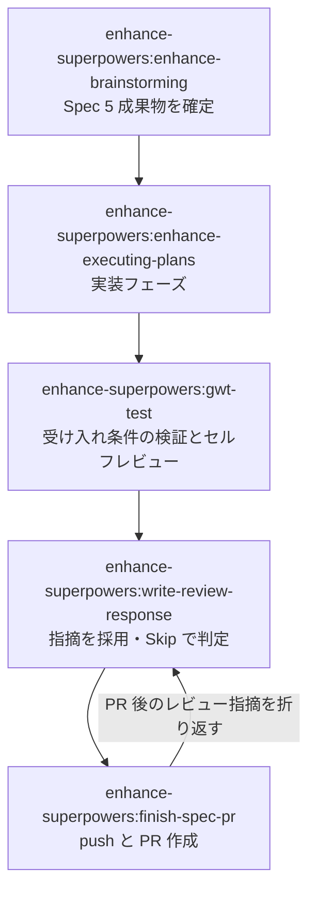
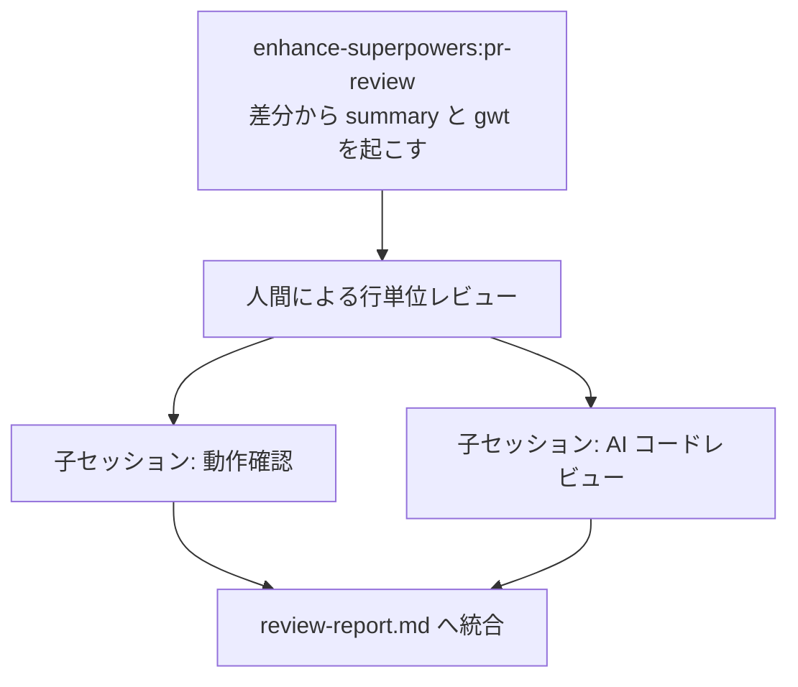

# enhance-superpowers

> 配布・利用者サポートを目的としない紹介文書

公式 superpowers plugin の直線フロー（brainstorming → writing-plans → executing-plans）に、**Spec フェーズでの 5 成果物確定**（summary / spec / gwt / pr-description / plan）・**specialist agent の能動 dispatch**・**監査ログ**・**コンプライアンス trigger**（機微情報チェック / ライセンスチェック / AI 利用ポリシー読み込み）を被せた強化版。

スキルは 2 方向に分かれる。**implementer 側**は自分がこれから書くコードの Spec を先に決めて実装・検証し、PR を出すまでを扱う。**レビュワー側**は他人の PR を受け取り、完成した差分から設計意図を逆算して検証する。gwt.md の出所が逆転する（前者は先に書いたものを読み、後者は差分から起こす）ため、同じスキルには収まらない（[ADR-0017](docs/adr/0017-reviewer-side-skill-and-parallel-sessions.md)）。

## スキル（implementer 側）

自分が書くコードの Spec を決め、実装し、PR を出すまで。原則として前のスキルが次を chain invoke する。

| skill | 役割 | 起動のきっかけ |
|---|---|---|
| `enhance-superpowers:enhance-brainstorming` | 起点。公式 brainstorming + writing-plans を内部 invoke し、Spec フェーズの 5 成果物を plan-last 順で確定する。各 Phase で specialist agent を能動 dispatch し、機微情報チェックとライセンスチェックを組み込む | 実装に入る前に要件と計画を固めたいとき |
| `enhance-superpowers:enhance-executing-plans` | 実装フェーズ。executor agent を skill 側から直接 dispatch し、スライスごとにレビュー系 agent を能動 dispatch する | Spec 確定後の chain、または既存の plan.md を持って途中から入るとき |
| `enhance-superpowers:gwt-test` | gwt.md の受け入れ条件をブラウザ操作で検証し、チェックリストと変更履歴を更新する。網羅性レビューとセルフレビューの能動 dispatch を含む | 実装フェーズ完了後の chain |
| `enhance-superpowers:write-review-response` | ローカルの agent findings と PR 上の unresolved な指摘を、採用 / Skip の 2 値で判定して review-response.md に記録する | 検証完了後の chain、または PR にレビュー指摘が付いたとき |
| `enhance-superpowers:finish-spec-pr` | pr-description.md を body として push + PR 作成を行い、作成後にレビューを invoke して指摘があれば折り返す | レビュー応答が済み、PR を出すとき |

## スキル（レビュワー側）

| skill | 役割 | 起動のきっかけ |
|---|---|---|
| `enhance-superpowers:pr-review` | PR 番号を起点に差分を読み、把握用の summary.md と動作確認の土台となる gwt.md を生成する。人間の行単位レビューを挟んだのち、動作確認と AI コードレビューを子セッション 2 本で並走させ、結果を review-report.md に統合する。成果物は発動元リポジトリに置き、レビュー対象のブランチは汚さない | 他人の PR をレビューするとき |

## エージェント

**本コレクションは固有のエージェントを持たない。** dispatch 先は `shared` plugin が提供するエンジニアリング系エージェントで、`shared:<agent>`（例: `shared:software-architect`）の修飾名で起動する。bare name は解決されない（root [ADR-0010](../docs/adr/0010-shared-as-plugin-agent-namespace.md)）。どのスキルのどのステップで誰を dispatch するかは [`CONTEXT.md`](CONTEXT.md) の dispatch matrix が正本。

## フロー（implementer 側）

## フロー（レビュワー側）

## 前提

- **`shared` plugin の install が必要**。エージェントの実体は `shared` 側にあり、複製は持たない（root [ADR-0010](../docs/adr/0010-shared-as-plugin-agent-namespace.md)）
- 公式 superpowers plugin のスキルを内部で invoke する
- 外部コレクションから呼ばれる場合は、出力先・chain 抑止・承認ゲートの集約を引数で制御する（[ADR-0014](docs/adr/0014-output-dir-arg-chain-suppression-gate-aggregation.md)）。実例として `indie-studio` が S5 の実装以降を本コレクションへ委譲している

install 手順は [root README](../README.md) にある。

## もっと知るには

- [`CONTEXT.md`](CONTEXT.md) — 語彙と設計の真実源、dispatch matrix
- [`docs/adr/`](docs/adr/) — 設計判断と却下理由
- [`templates/`](templates/) — 5 成果物のテンプレート
- [`../CONTEXT-MAP.md`](../CONTEXT-MAP.md) — リポジトリ内のコレクション索引
