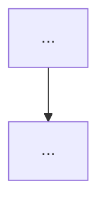

# {機能名} — サマリー

> 本書は TL;DR。詳細は design、実装手順は plan を参照（plan は `writing-plans` skill で後続作成）。

## 一言で

{この機能が何を実現するか、採用する主方式・既存パターンとの関係を 2〜3 文で}

## 方式の要点

- **{方式 1}**: {要点・採否理由}
- **{方式 2}**: {要点・採否理由}

## フロー図

## 効いている設計判断

- **{判断 1}**: {理由・トレードオフ・他案を採らない根拠}
- **{判断 2}**: {理由・トレードオフ}

## スコープ外

- {今回含めない項目とその理由}

## 確認事項（実装フェーズ）

- {実装時に実物で動作確認すべき点 / 回帰確認すべき点}

## レビュー履歴

> 各 Phase で agent を dispatch した記録 (時刻 / agent / 目的 / 回答要約)。enhance-brainstorming Phase 2 で初期化、後続 Phase の dispatch log も追記される。形式は ADR-0007 参照。

- {YYYY-MM-DD HH:MM} - `{agent-name}` を Phase {N} で dispatch (目的: {目的}) → 「{回答要約}」
