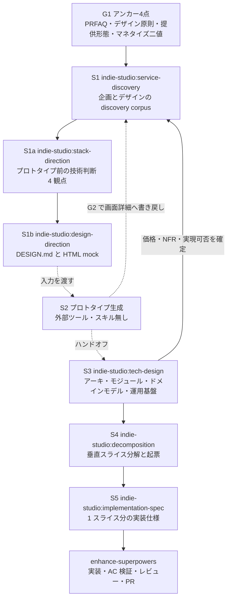

# indie-studio

> この README は**リポジトリを参考として人に見せる**ための紹介文書であり、配布・利用者サポートを目的としない（root [ADR-0012](../docs/adr/0012-author-only-distribution-premise.md)）。

個人開発のサービス設計〜デザイン〜開発を、AI が自律で回すためのハーネス（制御層）。人間が握るのは**アンカー4点**（PRFAQ / デザイン原則 / 提供形態 / マネタイズ二値）と、各ステージ後のレビューゲートだけで、その間の企画・デザイン・技術設計・分解・実装仕様の導出はステージごとのスキルと職種エージェントが担う。

設計の骨格は**ステージ番号**（`S1` → `S1a` → `S1b` → `S2` → `S3` → `S4` → `S5`）で、各ステージは前ステージの成果物を入力に取る。各スキルは「ディレクター（スキルを読んだメインセッション）＋職種エージェント群＋評価エージェント」という共通形で corpus を生む。

## スキル

| ステージ | skill | 役割 | 起動のきっかけ |
|---|---|---|---|
| S1 | `indie-studio:service-discovery` | アンカー4点から企画・デザインの discovery corpus と、プロトタイプ用ブリーフを起こす | 新規サービスをアンカーから立ち上げる／既存アンカーから企画を導出するとき |
| S1a | `indie-studio:stack-direction` | プロトタイプ前に握るべき技術判断 4 観点（スタック決定 / データプロファイル当たり / 3rd party 依存と制約 / build vs buy）を self-grill で導出する | discovery corpus が揃い、プロトタイプに入る前に技術方針を確定したいとき |
| S1b | `indie-studio:design-direction` | discovery corpus と任意の参考画像から、デザイン憲法 `DESIGN.md` と HTML mock を組み上げる | スタック確定後、プロトタイプ生成に渡すデザイン方向を決めたいとき |
| S3 | `indie-studio:tech-design` | プロトタイプと discovery corpus から技術スタック・アーキテクチャ・モジュール構成・ドメインモデル・運用基盤を固め、サービス repo をセットアップする | プロトタイプのハンドオフを受けたとき |
| S4 | `indie-studio:decomposition` | 機能一覧・モジュール構造・画面詳細から、機能を実装単位の垂直スライス（＝1 PR）へ分解し、人間の承認後に issue トラッカーへ起票する | 技術設計が固まり、実装計画に落とすとき |
| S5 | `indie-studio:implementation-spec` | 起票済みチケットと技術設計 docs から 1 スライス分の実装仕様を確定し、issue を精緻化してから実装以降を `enhance-superpowers` へ委譲する | 個々のスライスの実装に着手するとき |

**S2（プロトタイプ生成）に対応するスキルは無い。** このステージは外部ツール（Claude Design）が担うため、本コレクションは S1b で入力（`DESIGN.md` と mock）を用意し、S3 でハンドオフ結果を受け取る側に回る。

## エージェント

いずれもスキルから起動される職種エージェント。起動は `indie-studio:<agent>` の修飾名で行う（bare name は解決されない — root [ADR-0010](../docs/adr/0010-shared-as-plugin-agent-namespace.md)）。

| agent | 役割 | 起動元 |
|---|---|---|
| `indie-studio:ux-researcher` | アンカーを答え合わせ材料に self-grill し、persona と usage-scenes を自律導出する | S1 |
| `indie-studio:product-manager` | feature-scope / roadmap / specific-topics / risks-assumptions / nfr-targets を自律導出する | S1 |
| `indie-studio:business-strategist` | competition / pitch / monetization / marketing / kpi / legal を自律導出する | S1 |
| `indie-studio:product-designer` | S1 では画面一覧と画面詳細を導出。S1b では雰囲気を握る対話と `DESIGN.md` の組み上げ、視覚確認ゲート差し戻し時の token 修正を担う | S1 / S1b |
| `indie-studio:visual-designer` | 参考画像を読み、mood・カラーパレット・タイポグラフィ vibe・atmosphere を構造化抽出して product-designer に返す。画像が無い場合はアンカーからトーン記述子を抽出する | S1b |
| `indie-studio:ui-prototyper` | 合格版 `DESIGN.md` と画面一覧から、token を CSS custom property に写像した HTML mock を 1 ファイル統合で生成する | S1b |

エンジニアリング系の職種（アーキテクト / 各エンジニア / レビュアー等）は本コレクションでは持たず、`shared` plugin が提供するものを `shared:<agent>` の修飾名で使う。

## フロー

破線は外部ツール（S2）との受け渡しを表す。下流から S1 へ戻る矢印は、パイプラインが前方一方向ではなく、プロトタイプや技術見積もりで判明した内容を企画側へ書き戻すことを示す。

## 前提

install しておく必要のある plugin は次のとおり。

- **`shared`** — エンジニアリング系の中立エージェントと helper スキルを単一の実体として提供する共有基盤。エージェントは `shared:<agent>` の修飾名で起動する（root [ADR-0010](../docs/adr/0010-shared-as-plugin-agent-namespace.md)）
- **`enhance-superpowers`** — S5 の実装以降（実装・AC 検証・コードレビュー・PR）を丸ごと委譲する先（[ADR-0032](docs/adr/0032-s5-spec-in-harness-implementation-delegated.md)）

install 手順は [root README](../README.md) にある。

## もっと知るには

- [`CONTEXT.md`](CONTEXT.md) — 語彙と設計の真実源
- [`docs/adr/`](docs/adr/) — 設計判断と却下理由
- [`docs/ROADMAP.md`](docs/ROADMAP.md) — 進行中の計画と運用
- [`../CONTEXT-MAP.md`](../CONTEXT-MAP.md) — リポジトリ内のコレクション索引
